# kul-badge

<!-- Auto Generated Below -->

## Properties

| Property   | Attribute   | Description                                     | Type                | Default         |
| ---------- | ----------- | ----------------------------------------------- | ------------------- | --------------- |
| `kulData`  | --          | The actual data of the article.                 | `KulArticleDataset` | `null`          |
| `kulEmpty` | `kul-empty` | Empty text displayed when there is no data.     | `string`            | `"Empty data."` |
| `kulStyle` | `kul-style` | Enables customization of the component's style. | `string`            | `""`            |

## Events

| Event               | Description | Type                                  |
| ------------------- | ----------- | ------------------------------------- |
| `kul-article-event` |             | `CustomEvent<KulArticleEventPayload>` |

## Methods

### `getDebugInfo() => Promise<KulDebugLifecycleInfo>`

Retrieves the debug information reflecting the current state of the component.

#### Returns

Type: `Promise<KulDebugLifecycleInfo>`

A promise that resolves to a KulDebugLifecycleInfo object containing debug information.

### `getProps() => Promise<KulArticlePropsInterface>`

Used to retrieve component's properties and descriptions.

#### Returns

Type: `Promise<KulArticlePropsInterface>`

Promise resolved with an object containing the component's properties.

### `refresh() => Promise<void>`

Triggers a re-render of the component to reflect any state changes.

#### Returns

Type: `Promise<void>`

### `unmount(ms?: number) => Promise<void>`

Initiates the unmount sequence, which removes the component from the DOM after a delay.

#### Parameters

| Name | Type     | Description              |
| ---- | -------- | ------------------------ |
| `ms` | `number` | - Number of milliseconds |

#### Returns

Type: `Promise<void>`

## CSS Custom Properties

| Name                                | Description                                                                          |
| ----------------------------------- | ------------------------------------------------------------------------------------ |
| `--kul-article-content-color`       | Sets the color for .content elements. Defaults to var(--kul-text-color)              |
| `--kul-article-content-font-family` | Sets the font family for .content elements. Defaults to var(--kul-font-family)       |
| `--kul-article-content-font-size`   | Sets the font size for .content elements. Defaults to var(--kul-font-size)           |
| `--kul-article-h1-color`            | Sets the color for <h1> elements. Defaults to var(--kul-text-color)                  |
| `--kul-article-h1-font-family`      | Sets the font family for <h1> elements. Defaults to var(--kul-font-family)           |
| `--kul-article-h1-font-size`        | Sets the font size for <h1> elements. Defaults to calc(var(--kul-font-size) * 1.25)  |
| `--kul-article-h2-color`            | Sets the color for <h2> elements. Defaults to var(--kul-text-color)                  |
| `--kul-article-h2-font-family`      | Sets the font family for <h2> elements. Defaults to var(--kul-font-family)           |
| `--kul-article-h2-font-size`        | Sets the font size for <h2> elements. Defaults to calc(var(--kul-font-size) * 1.125) |
| `--kul-article-h3-color`            | Sets the color for <h3> elements. Defaults to var(--kul-text-color)                  |
| `--kul-article-h3-font-family`      | Sets the font family for <h3> elements. Defaults to var(--kul-font-family)           |
| `--kul-article-h3-font-size`        | Sets the font size for <h3> elements. Defaults to 1.5em                              |
| `--kul-article-margin`              | Sets the margin of the article tag. Defaults to automatic.                           |
| `--kul-article-max-width`           | Sets the max-width of the article tag. Defaults to 1200px.                           |
| `--kul-article-padding`             | Sets the padding of the article tag. Defaults to 40px.                               |

## Dependencies

### Used by

 - [kul-showcase](../kul-showcase)
 - [kul-showcase-accordion](../kul-showcase/components/accordion)
 - [kul-showcase-article](../kul-showcase/components/article)
 - [kul-showcase-badge](../kul-showcase/components/badge)
 - [kul-showcase-button](../kul-showcase/components/button)
 - [kul-showcase-canvas](../kul-showcase/components/canvas)
 - [kul-showcase-card](../kul-showcase/components/card)
 - [kul-showcase-carousel](../kul-showcase/components/carousel)
 - [kul-showcase-chart](../kul-showcase/components/chart)
 - [kul-showcase-chat](../kul-showcase/components/chat)
 - [kul-showcase-chip](../kul-showcase/components/chip)
 - [kul-showcase-code](../kul-showcase/components/code)
 - [kul-showcase-compare](../kul-showcase/components/compare)
 - [kul-showcase-debug](../kul-showcase/utilities/debug)
 - [kul-showcase-drawer](../kul-showcase/components/drawer)
 - [kul-showcase-header](../kul-showcase/components/header)
 - [kul-showcase-image](../kul-showcase/components/image)
 - [kul-showcase-imageviewer](../kul-showcase/components/imageviewer)
 - [kul-showcase-kuldata](../kul-showcase/framework/data)
 - [kul-showcase-kuldebug](../kul-showcase/framework/debug)
 - [kul-showcase-kulllm](../kul-showcase/framework/llm)
 - [kul-showcase-kulmanager](../kul-showcase/framework/manager)
 - [kul-showcase-kulportal](../kul-showcase/framework/portal)
 - [kul-showcase-kulscrollonhover](../kul-showcase/framework/scroll-on-hover)
 - [kul-showcase-kultheme](../kul-showcase/framework/theme)
 - [kul-showcase-lazy](../kul-showcase/components/lazy)
 - [kul-showcase-list](../kul-showcase/components/list)
 - [kul-showcase-masonry](../kul-showcase/components/masonry)
 - [kul-showcase-messenger](../kul-showcase/components/messenger)
 - [kul-showcase-photoframe](../kul-showcase/components/photoframe)
 - [kul-showcase-progressbar](../kul-showcase/components/progressbar)
 - [kul-showcase-slider](../kul-showcase/components/slider)
 - [kul-showcase-spinner](../kul-showcase/components/spinner)
 - [kul-showcase-splash](../kul-showcase/components/splash)
 - [kul-showcase-tabbar](../kul-showcase/components/tabbar)
 - [kul-showcase-textfield](../kul-showcase/components/textfield)
 - [kul-showcase-toast](../kul-showcase/components/toast)
 - [kul-showcase-toggle](../kul-showcase/components/toggle)
 - [kul-showcase-tree](../kul-showcase/components/tree)
 - [kul-showcase-typewriter](../kul-showcase/components/typewriter)
 - [kul-showcase-upload](../kul-showcase/components/upload)

### Graph

```mermaid
graph TD;
  kul-showcase --> kul-article
  kul-showcase-accordion --> kul-article
  kul-showcase-article --> kul-article
  kul-showcase-badge --> kul-article
  kul-showcase-button --> kul-article
  kul-showcase-canvas --> kul-article
  kul-showcase-card --> kul-article
  kul-showcase-carousel --> kul-article
  kul-showcase-chart --> kul-article
  kul-showcase-chat --> kul-article
  kul-showcase-chip --> kul-article
  kul-showcase-code --> kul-article
  kul-showcase-compare --> kul-article
  kul-showcase-debug --> kul-article
  kul-showcase-drawer --> kul-article
  kul-showcase-header --> kul-article
  kul-showcase-image --> kul-article
  kul-showcase-imageviewer --> kul-article
  kul-showcase-kuldata --> kul-article
  kul-showcase-kuldebug --> kul-article
  kul-showcase-kulllm --> kul-article
  kul-showcase-kulmanager --> kul-article
  kul-showcase-kulportal --> kul-article
  kul-showcase-kulscrollonhover --> kul-article
  kul-showcase-kultheme --> kul-article
  kul-showcase-lazy --> kul-article
  kul-showcase-list --> kul-article
  kul-showcase-masonry --> kul-article
  kul-showcase-messenger --> kul-article
  kul-showcase-photoframe --> kul-article
  kul-showcase-progressbar --> kul-article
  kul-showcase-slider --> kul-article
  kul-showcase-spinner --> kul-article
  kul-showcase-splash --> kul-article
  kul-showcase-tabbar --> kul-article
  kul-showcase-textfield --> kul-article
  kul-showcase-toast --> kul-article
  kul-showcase-toggle --> kul-article
  kul-showcase-tree --> kul-article
  kul-showcase-typewriter --> kul-article
  kul-showcase-upload --> kul-article
  style kul-article fill:#f9f,stroke:#333,stroke-width:4px
```

----------------------------------------------

*Built with [StencilJS](https://stenciljs.com/)*
