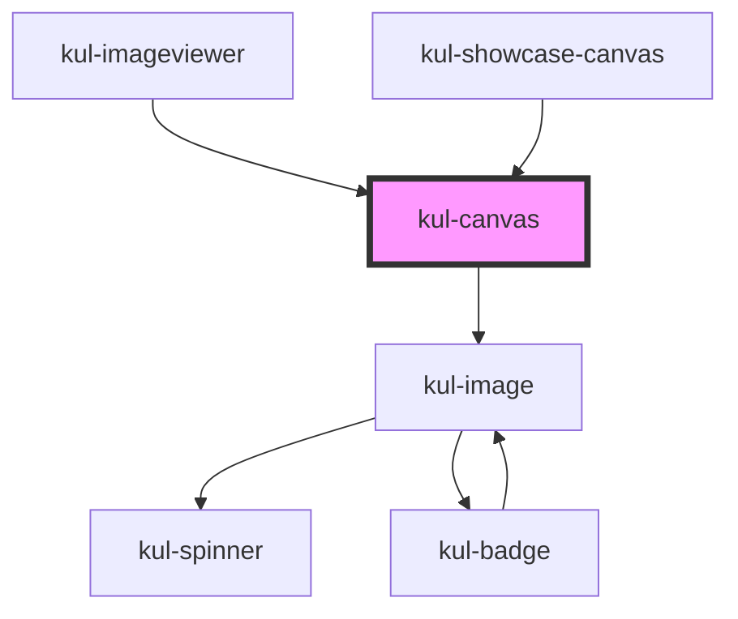

# kul-canvas

<!-- Auto Generated Below -->

## Properties

| Property             | Attribute              | Description                                                                                                                                        | Type                     | Default     |
| -------------------- | ---------------------- | -------------------------------------------------------------------------------------------------------------------------------------------------- | ------------------------ | ----------- |
| `kulBrush`           | `kul-brush`            | The shape of the brush.                                                                                                                            | `"round" \| "square"`    | `"round"`   |
| `kulColor`           | `kul-color`            | The color of the brush.                                                                                                                            | `string`                 | `"#ff0000"` |
| `kulCursor`          | `kul-cursor`           | Sets the style of the cursor.                                                                                                                      | `"default" \| "preview"` | `"preview"` |
| `kulImageProps`      | --                     | The props of the image displayed inside the badge.                                                                                                 | `KulImagePropsInterface` | `null`      |
| `kulOpacity`         | `kul-opacity`          | The opacity of the brush.                                                                                                                          | `number`                 | `1.0`       |
| `kulPreview`         | `kul-preview`          | Displays the brush track of the current stroke.                                                                                                    | `boolean`                | `true`      |
| `kulSize`            | `kul-size`             | The size of the brush.                                                                                                                             | `number`                 | `10`        |
| `kulStrokeTolerance` | `kul-stroke-tolerance` | Simplifies the coordinates array by applying the Ramer-Douglas-Peucker algorithm. This prop sets the tolerance of the algorithm (null to disable). | `number`                 | `null`      |
| `kulStyle`           | `kul-style`            | Customizes the style of the component.                                                                                                             | `string`                 | `""`        |

## Events

| Event              | Description | Type                                 |
| ------------------ | ----------- | ------------------------------------ |
| `kul-canvas-event` |             | `CustomEvent<KulCanvasEventPayload>` |

## Methods

### `clearCanvas(type?: KulCanvasType) => Promise<void>`

Clears the specified canvas.

#### Parameters

| Name   | Type                   | Description               |
| ------ | ---------------------- | ------------------------- |
| `type` | `"board" \| "preview"` | - The type of the canvas. |

#### Returns

Type: `Promise<void>`

### `getCanvas(type?: KulCanvasType) => Promise<HTMLCanvasElement>`

Returns the canvas HTML element.

#### Parameters

| Name   | Type                   | Description               |
| ------ | ---------------------- | ------------------------- |
| `type` | `"board" \| "preview"` | - The type of the canvas. |

#### Returns

Type: `Promise<HTMLCanvasElement>`

The painting canvas.

### `getDebugInfo() => Promise<KulDebugLifecycleInfo>`

Fetches debug information of the component's current state.

#### Returns

Type: `Promise<KulDebugLifecycleInfo>`

A promise that resolves with the debug information object.

### `getImage() => Promise<HTMLKulImageElement>`

Returns the image component.

#### Returns

Type: `Promise<HTMLKulImageElement>`

### `getProps() => Promise<KulCanvasPropsInterface>`

Used to retrieve component's properties and descriptions.

#### Returns

Type: `Promise<KulCanvasPropsInterface>`

Promise resolved with an object containing the component's properties.

### `refresh() => Promise<void>`

This method is used to trigger a new render of the component.

#### Returns

Type: `Promise<void>`

### `resizeCanvas() => Promise<void>`

Automatically resizes the canvas to the match the size of the container.

#### Returns

Type: `Promise<void>`

### `setCanvasHeight(value?: number) => Promise<void>`

Sets the height of the canvas.

#### Parameters

| Name    | Type     | Description |
| ------- | -------- | ----------- |
| `value` | `number` |             |

#### Returns

Type: `Promise<void>`

### `setCanvasWidth(value?: number) => Promise<void>`

Sets the width of the canvas.

#### Parameters

| Name    | Type     | Description |
| ------- | -------- | ----------- |
| `value` | `number` |             |

#### Returns

Type: `Promise<void>`

### `unmount(ms?: number) => Promise<void>`

Initiates the unmount sequence, which removes the component from the DOM after a delay.

#### Parameters

| Name | Type     | Description              |
| ---- | -------- | ------------------------ |
| `ms` | `number` | - Number of milliseconds |

#### Returns

Type: `Promise<void>`

## Dependencies

### Used by

 - [kul-imageviewer](../kul-imageviewer)
 - [kul-showcase-canvas](../kul-showcase/components/canvas)

### Depends on

- [kul-image](../kul-image)

### Graph

----------------------------------------------

*Built with [StencilJS](https://stenciljs.com/)*
