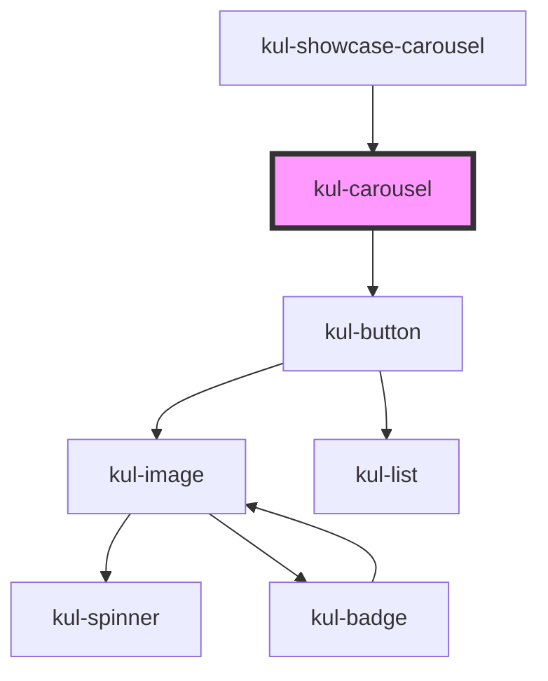

# kul-carousel

<!-- Auto Generated Below -->

## Properties

| Property      | Attribute       | Description                                  | Type                                                                                                                              | Default   |
| ------------- | --------------- | -------------------------------------------- | --------------------------------------------------------------------------------------------------------------------------------- | --------- |
| `kulAutoPlay` | `kul-auto-play` | Enable or disable autoplay for the carousel. | `boolean`                                                                                                                         | `false`   |
| `kulData`     | --              | Actual data of the carousel.                 | `KulDataDataset`                                                                                                                  | `null`    |
| `kulInterval` | `kul-interval`  | Interval in milliseconds for autoplay.       | `number`                                                                                                                          | `3000`    |
| `kulShape`    | `kul-shape`     | Sets the type of shapes to compare.          | `"badge" \| "button" \| "card" \| "chart" \| "chat" \| "chip" \| "code" \| "image" \| "number" \| "text" \| "toggle" \| "upload"` | `"image"` |
| `kulStyle`    | `kul-style`     | Custom style of the component.               | `string`                                                                                                                          | `""`      |

## Events

| Event                | Description | Type                                   |
| -------------------- | ----------- | -------------------------------------- |
| `kul-carousel-event` |             | `CustomEvent<KulCarouselEventPayload>` |

## Methods

### `getDebugInfo() => Promise<KulDebugLifecycleInfo>`

Fetches debug information of the component's current state.

#### Returns

Type: `Promise<KulDebugLifecycleInfo>`

A promise that resolves with the debug information object.

### `getProps() => Promise<KulCarouselPropsInterface>`

Used to retrieve component's properties and descriptions.

#### Returns

Type: `Promise<KulCarouselPropsInterface>`

Promise resolved with an object containing the component's properties.

### `goToSlide(index: number) => Promise<void>`

Changes the slide to the specified index if it's within bounds.

#### Parameters

| Name    | Type     | Description                         |
| ------- | -------- | ----------------------------------- |
| `index` | `number` | - The number of the slide to go to. |

#### Returns

Type: `Promise<void>`

### `nextSlide() => Promise<void>`

Advances to the next slide, looping back to the start if at the end.

#### Returns

Type: `Promise<void>`

### `prevSlide() => Promise<void>`

Moves to the previous slide, looping to the last slide if at the beginning.

#### Returns

Type: `Promise<void>`

### `refresh() => Promise<void>`

This method is used to trigger a new render of the component.

#### Returns

Type: `Promise<void>`

### `unmount(ms?: number) => Promise<void>`

Initiates the unmount sequence, which removes the component from the DOM after a delay.

#### Parameters

| Name | Type     | Description              |
| ---- | -------- | ------------------------ |
| `ms` | `number` | - Number of milliseconds |

#### Returns

Type: `Promise<void>`

## Dependencies

### Used by

 - [kul-showcase-carousel](../kul-showcase/components/carousel)

### Depends on

- [kul-button](../kul-button)

### Graph

----------------------------------------------

*Built with [StencilJS](https://stenciljs.com/)*
