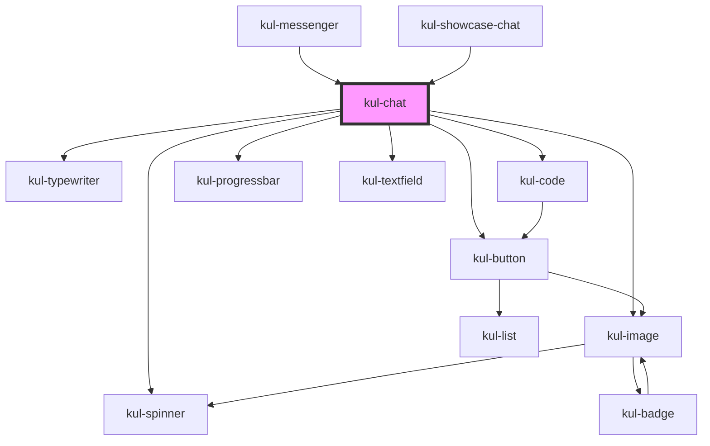

# kul-chat

<!-- Auto Generated Below -->

## Properties

| Property             | Attribute              | Description                                                                                                                        | Type                                  | Default                                                                                 |
| -------------------- | ---------------------- | ---------------------------------------------------------------------------------------------------------------------------------- | ------------------------------------- | --------------------------------------------------------------------------------------- |
| `kulContextWindow`   | `kul-context-window`   | How many tokens the context window can handle, used to calculate the occupied space.                                               | `number`                              | `8192`                                                                                  |
| `kulEndpointUrl`     | `kul-endpoint-url`     | Enables customization of the component's style.                                                                                    | `string`                              | `"http://localhost:5001"`                                                               |
| `kulLayout`          | `kul-layout`           | Sets the layout of the chat.                                                                                                       | `"bottom-textarea" \| "top-textarea"` | `"top-textarea"`                                                                        |
| `kulMaxTokens`       | `kul-max-tokens`       | The maximum amount of tokens allowed in the LLM's answer.                                                                          | `number`                              | `250`                                                                                   |
| `kulPollingInterval` | `kul-polling-interval` | How often the component checks whether the LLM endpoint is online or not.                                                          | `number`                              | `10000`                                                                                 |
| `kulSeed`            | `kul-seed`             | The seed of the LLM's answer.                                                                                                      | `number`                              | `-1`                                                                                    |
| `kulStyle`           | `kul-style`            | Enables customization of the component's style.                                                                                    | `string`                              | `""`                                                                                    |
| `kulSystem`          | `kul-system`           | System message for the LLM.                                                                                                        | `string`                              | `"You are a helpful and cheerful assistant eager to help the user out with his tasks."` |
| `kulTemperature`     | `kul-temperature`      | Sets the creative boundaries of the LLM.                                                                                           | `number`                              | `0.7`                                                                                   |
| `kulTypewriterProps` | --                     | Sets the props of the assistant typewriter component. Set this prop to false to replace the typewriter with a simple text element. | `KulTypewriterPropsInterface`         | `{     kulDeleteSpeed: 10,     kulTag: "p",     kulSpeed: 20,   }`                      |
| `kulValue`           | --                     | Sets the initial history of the chat.                                                                                              | `KulLLMChoiceMessage[]`               | `[]`                                                                                    |

## Events

| Event            | Description | Type                               |
| ---------------- | ----------- | ---------------------------------- |
| `kul-chat-event` |             | `CustomEvent<KulChatEventPayload>` |

## Methods

### `getDebugInfo() => Promise<KulDebugLifecycleInfo>`

Retrieves the debug information reflecting the current state of the component.

#### Returns

Type: `Promise<KulDebugLifecycleInfo>`

A promise that resolves to a KulDebugLifecycleInfo object containing debug information.

### `getHistory() => Promise<string>`

Returns the full history as a string.

#### Returns

Type: `Promise<string>`

Full history of the chat.

### `getLastMessage() => Promise<string>`

Returns the last message as a string.

#### Returns

Type: `Promise<string>`

The last message of the history.

### `getProps(descriptions?: boolean) => Promise<GenericObject>`

Retrieves the properties of the component, with optional descriptions.

#### Parameters

| Name           | Type      | Description                                                                          |
| -------------- | --------- | ------------------------------------------------------------------------------------ |
| `descriptions` | `boolean` | - If true, returns properties with descriptions; otherwise, returns properties only. |

#### Returns

Type: `Promise<GenericObject<unknown>>`

A promise that resolves to an object where each key is a property name, optionally with its description.

### `refresh() => Promise<void>`

Triggers a re-render of the component to reflect any state changes.

#### Returns

Type: `Promise<void>`

### `setHistory(history: string) => Promise<void>`

Sets the history of the component through a string.

#### Parameters

| Name      | Type     | Description |
| --------- | -------- | ----------- |
| `history` | `string` |             |

#### Returns

Type: `Promise<void>`

### `unmount(ms?: number) => Promise<void>`

Initiates the unmount sequence, which removes the component from the DOM after a delay.

#### Parameters

| Name | Type     | Description              |
| ---- | -------- | ------------------------ |
| `ms` | `number` | - Number of milliseconds |

#### Returns

Type: `Promise<void>`

## CSS Custom Properties

| Name                         | Description                                                       |
| ---------------------------- | ----------------------------------------------------------------- |
| `--kul-chat-blur-radius`     | Sets the blur radius for backdrop filters. Defaults to 3.5px.     |
| `--kul-chat-border-radius`   | Sets the border-radius for elements. Defaults to 8px.             |
| `--kul-chat-buttons-padding` | Sets the chat controls' padding. Defaults to 1em 0.               |
| `--kul-chat-grid-gap`        | Sets the gap between grid elements. Defaults to 16px.             |
| `--kul-chat-inner-padding`   | Sets the padding of the inner chat grid. Defaults to 0 16px.      |
| `--kul-chat-margin-bottom`   | Sets the bottom margin of the chat area. Defaults to 16px.        |
| `--kul-chat-margin-top`      | Sets the top margin of the chat area. Defaults to 16px.           |
| `--kul-chat-outer-grid-gap`  | Sets the gap between the outer grid's elements. Defaults to 12px. |
| `--kul-chat-padding`         | Sets the default padding for various elements. Defaults to 18px.  |
| `--kul-chat-small-font-size` | Sets the font size for small text elements. Defaults to 0.875em.  |
| `--kul-chat-spinner-size`    | Sets the size of the spinner. Defaults to 48px.                   |
| `--kul-chat-title-font-size` | Sets the font size for titles. Defaults to 2em.                   |

## Dependencies

### Used by

 - [kul-messenger](../kul-messenger)
 - [kul-showcase-chat](../kul-showcase/components/chat)

### Depends on

- [kul-spinner](../kul-spinner)
- [kul-typewriter](../kul-typewriter)
- [kul-code](../kul-code)
- [kul-image](../kul-image)
- [kul-button](../kul-button)
- [kul-progressbar](../kul-progressbar)
- [kul-textfield](../kul-textfield)

### Graph

----------------------------------------------

*Built with [StencilJS](https://stenciljs.com/)*
