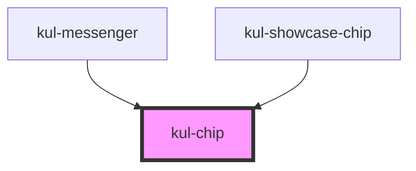

# kul-chip

<!-- Auto Generated Below -->

## Properties

| Property     | Attribute     | Description                                                                          | Type                                            | Default      |
| ------------ | ------------- | ------------------------------------------------------------------------------------ | ----------------------------------------------- | ------------ |
| `kulData`    | --            | The data of the chip list.                                                           | `KulDataDataset`                                | `null`       |
| `kulRipple`  | `kul-ripple`  | When set to true, the pointerdown event will trigger a ripple effect.                | `boolean`                                       | `true`       |
| `kulStyle`   | `kul-style`   | Custom style of the component.                                                       | `string`                                        | `""`         |
| `kulStyling` | `kul-styling` | Styling of the chip component, includes: "choice", "input", "filter" and "standard". | `"choice" \| "filter" \| "input" \| "standard"` | `"standard"` |

## Events

| Event            | Description | Type                               |
| ---------------- | ----------- | ---------------------------------- |
| `kul-chip-event` |             | `CustomEvent<KulChipEventPayload>` |

## Methods

### `getDebugInfo() => Promise<KulDebugLifecycleInfo>`

Fetches debug information of the component's current state.

#### Returns

Type: `Promise<KulDebugLifecycleInfo>`

A promise that resolves with the debug information object.

### `getProps() => Promise<KulChipPropsInterface>`

Used to retrieve component's properties and descriptions.

#### Returns

Type: `Promise<KulChipPropsInterface>`

Promise resolved with an object containing the component's properties.

### `getSelectedNodes() => Promise<Set<KulDataNode>>`

Returns the selected nodes.

#### Returns

Type: `Promise<Set<KulDataNode>>`

Selected nodes.

### `refresh() => Promise<void>`

This method is used to trigger a new render of the component.

#### Returns

Type: `Promise<void>`

### `setSelectedNodes(nodes: (KulDataNode[] | string[]) & Array<any>) => Promise<void>`

Selects one or more nodes in the chip component.

#### Parameters

| Name    | Type                                  | Description                                                   |
| ------- | ------------------------------------- | ------------------------------------------------------------- |
| `nodes` | `(string[] \| KulDataNode[]) & any[]` | - An array of KulDataNode objects or node IDs to be selected. |

#### Returns

Type: `Promise<void>`

### `unmount(ms?: number) => Promise<void>`

Initiates the unmount sequence, which removes the component from the DOM after a delay.

#### Parameters

| Name | Type     | Description              |
| ---- | -------- | ------------------------ |
| `ms` | `number` | - Number of milliseconds |

#### Returns

Type: `Promise<void>`

## CSS Custom Properties

| Name                           | Description                                                                                                          |
| ------------------------------ | -------------------------------------------------------------------------------------------------------------------- |
| `--kul-chip-background-color`  | Sets background color of the component. Defaults to the value of --kul-background-color.                             |
| `--kul-chip-border-radius`     | Sets border radius of the chips. Defaults to 16px.                                                                   |
| `--kul-chip-font-family`       | Sets font family of the chips. Defaults to the value of --kul-font-family.                                           |
| `--kul-chip-font-size`         | Sets font size of the chips. Defaults to the value of --kul-font-size.                                               |
| `--kul-chip-font-weight`       | Sets font weight of the chips. Defaults to the value of --kul-font-weight.                                           |
| `--kul-chip-height`            | Sets height of the chips. Defaults to 32px.                                                                          |
| `--kul-chip-indent-multiplier` | Sets the indentation multiplier for children chips. Defaults to 10.                                                  |
| `--kul-chip-margin`            | Sets margin of the chips. Defaults to 4px.                                                                           |
| `--kul-chip-padding`           | Sets padding of the chips. Defaults to 0 12px.                                                                       |
| `--kul-chip-primary-color`     | Sets primary color of the component. Defaults to the value of --kul-primary-color.                                   |
| `--kul-chip-primary-color-rgb` | Sets primary color RGB values of the component (used for shaders). Defaults to the value of --kul-primary-color-rgb. |
| `--kul-chip-text-color`        | Sets text color of the component. Defaults to the value of --kul-text-color.                                         |
| `--kul-chip-text-color-rgb`    | Sets text color RGB values of the component (used for shaders). Defaults to the value of --kul-text-color-rgb.       |

## Dependencies

### Used by

 - [kul-messenger](../kul-messenger)
 - [kul-showcase-chip](../kul-showcase/components/chip)

### Graph

----------------------------------------------

*Built with [StencilJS](https://stenciljs.com/)*
