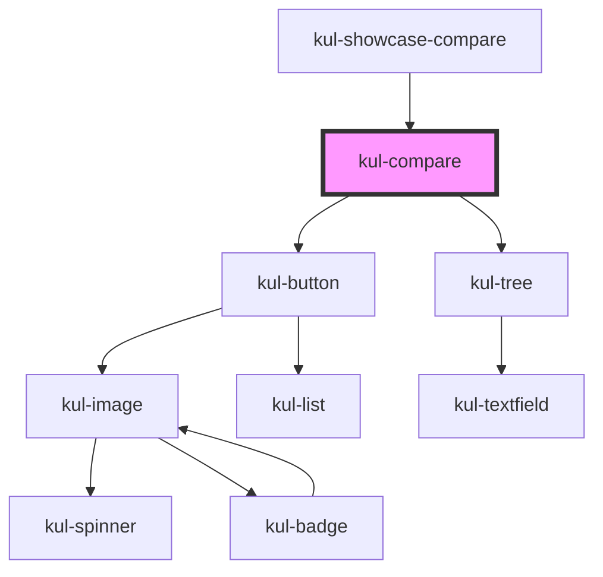

# kul-accordion

<!-- Auto Generated Below -->

## Properties

| Property | Attribute | Description | Type | Default |
| --- | --- | --- | --- | --- |
| `kulData` | -- | Actual data of the compare. | `KulDataDataset` | `null` |
| `kulShape` | `kul-shape` | Sets the type of shapes to compare. | `"badge" \| "button" \| "card" \| "chart" \| "chat" \| "chip" \| "code" \| "image" \| "number" \| "text" \| "toggle" \| "upload"` | `'image'` |
| `kulStyle` | `kul-style` | Custom style of the component. | `string` | `''` |
| `kulView` | `kul-view` | Sets the type of view, either styled as a before-after or a side-by-side comparison. | `"overlay" \| "split"` | `'overlay'` |

## Events

| Event | Description | Type |
| --- | --- | --- |
| `kul-compare-event` | Describes event emitted. | `CustomEvent<KulCompareEventPayload>` |

## Methods

### `getDebugInfo() => Promise<KulDebugLifecycleInfo>`

Fetches debug information of the component's current state.

#### Returns

Type: `Promise<KulDebugLifecycleInfo>`

A promise that resolves with the debug information object.

### `getProps(descriptions?: boolean) => Promise<GenericObject>`

Used to retrieve component's properties and descriptions.

#### Parameters

| Name | Type | Description |
| --- | --- | --- |
| `descriptions` | `boolean` | - When true, includes descriptions for each property. |

#### Returns

Type: `Promise<GenericObject<unknown>>`

Promise resolved with an object containing the component's properties.

### `refresh() => Promise<void>`

This method is used to trigger a new render of the component.

#### Returns

Type: `Promise<void>`

### `unmount(ms?: number) => Promise<void>`

Initiates the unmount sequence, which removes the component from the DOM after a delay.

#### Parameters

| Name | Type     | Description              |
| ---- | -------- | ------------------------ |
| `ms` | `number` | - Number of milliseconds |

#### Returns

Type: `Promise<void>`

## CSS Custom Properties

| Name | Description |
| --- | --- |
| `--kul-compare-change-view-background-color` | Sets the background color of the bottom bar. Defaults to var(--kul-title-background-color). |
| `--kul-compare-change-view-padding` | Sets the padding of the bottom bar. Defaults to 8px. |
| `--kul-compare-grid-template` | Sets the grid's layout. Defaults to 1fr auto. |
| `--kul-compare-slider-color` | Sets the color of the overlay slider. Defaults to var(--kul-title-background-color). |
| `--kul-compare-slider-width` | Sets the width of the overlay slider. Defaults to 3px. |

## Dependencies

### Used by

- [kul-showcase-compare](../kul-showcase/components/compare)

### Depends on

- [kul-button](../kul-button)
- [kul-tree](../kul-tree)

### Graph

---

_Built with [StencilJS](https://stenciljs.com/)_
