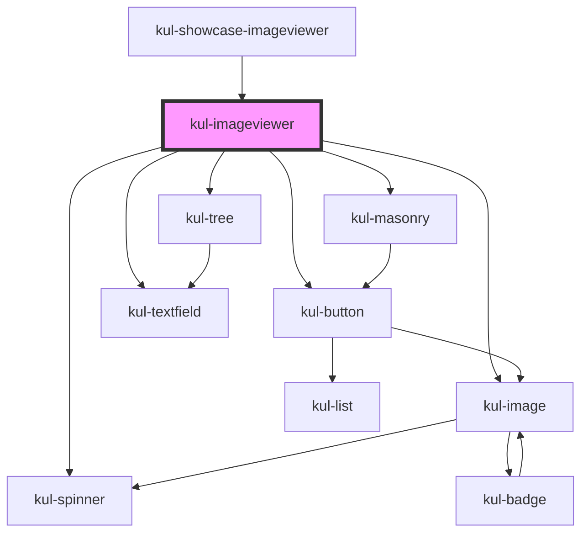

# kul-imageviewer

<!-- Auto Generated Below -->

## Properties

| Property          | Attribute   | Description                                       | Type                                                          | Default |
| ----------------- | ----------- | ------------------------------------------------- | ------------------------------------------------------------- | ------- |
| `kulData`         | --          | Actual data of the image viewer.                  | `KulDataDataset`                                              | `{}`    |
| `kulLoadCallback` | --          | Callback invoked when the load button is clicked. | `(imageviewer: KulImageviewer, dir: string) => Promise<void>` | `null`  |
| `kulStyle`        | `kul-style` | Custom style of the component.                    | `string`                                                      | `''`    |
| `kulValue`        | --          | Configuration parameters of the detail view.      | `KulDataDataset`                                              | `{}`    |

## Events

| Event                   | Description              | Type                                      |
| ----------------------- | ------------------------ | ----------------------------------------- |
| `kul-imageviewer-event` | Describes event emitted. | `CustomEvent<KulImageviewerEventPayload>` |

## Methods

### `addSnapshot(value: string) => Promise<void>`

Appends a new snapshot to the current shape's history by duplicating it with an updated value.
It has no effect when the current shape is not set.

#### Parameters

| Name    | Type     | Description |
| ------- | -------- | ----------- |
| `value` | `string` |             |

#### Returns

Type: `Promise<void>`

### `getDebugInfo() => Promise<KulDebugLifecycleInfo>`

Fetches debug information of the component's current state.

#### Returns

Type: `Promise<KulDebugLifecycleInfo>`

A promise that resolves with the debug information object.

### `getProps(descriptions?: boolean) => Promise<GenericObject>`

Used to retrieve component's properties and descriptions.

#### Parameters

| Name           | Type      | Description                                           |
| -------------- | --------- | ----------------------------------------------------- |
| `descriptions` | `boolean` | - When true, includes descriptions for each property. |

#### Returns

Type: `Promise<GenericObject<unknown>>`

Promise resolved with an object containing the component's properties.

### `refresh() => Promise<void>`

This method is used to trigger a new render of the component.

#### Returns

Type: `Promise<void>`

### `unmount(ms?: number) => Promise<void>`

Initiates the unmount sequence, which removes the component from the DOM after a delay.

#### Parameters

| Name | Type     | Description              |
| ---- | -------- | ------------------------ |
| `ms` | `number` | - Number of milliseconds |

#### Returns

Type: `Promise<void>`

## Dependencies

### Used by

 - [kul-showcase-imageviewer](../kul-showcase/components/imageviewer)

### Depends on

- [kul-button](../kul-button)
- [kul-spinner](../kul-spinner)
- [kul-image](../kul-image)
- [kul-masonry](../kul-masonry)
- [kul-textfield](../kul-textfield)
- [kul-tree](../kul-tree)

### Graph

----------------------------------------------

*Built with [StencilJS](https://stenciljs.com/)*
