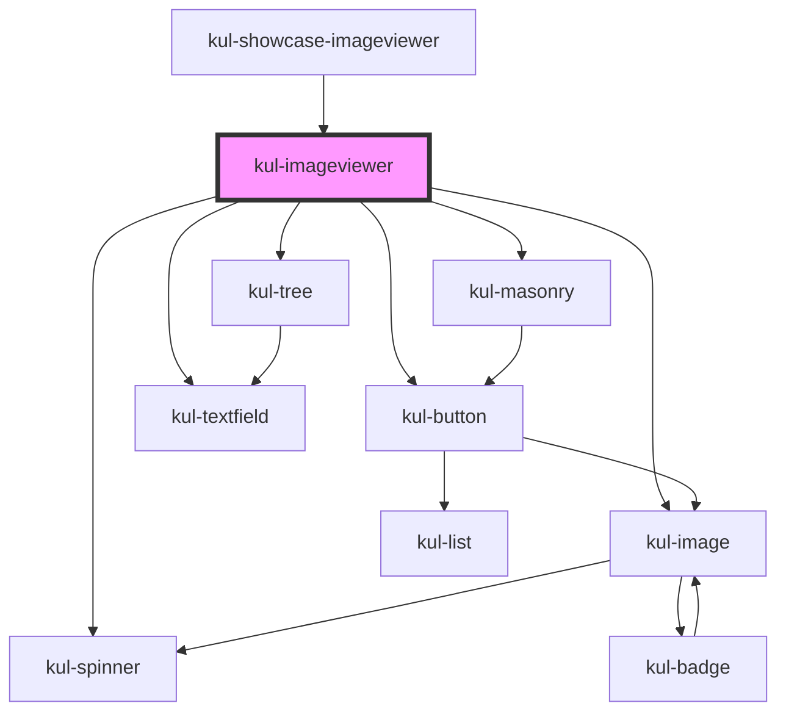

# kul-imageviewer

<!-- Auto Generated Below -->

## Properties

| Property          | Attribute   | Description                                       | Type                                                          | Default |
| ----------------- | ----------- | ------------------------------------------------- | ------------------------------------------------------------- | ------- |
| `kulData`         | --          | Actual data of the image viewer.                  | `KulDataDataset`                                              | `{}`    |
| `kulLoadCallback` | --          | Callback invoked when the load button is clicked. | `(imageviewer: KulImageviewer, dir: string) => Promise<void>` | `null`  |
| `kulStyle`        | `kul-style` | Custom style of the component.                    | `string`                                                      | `''`    |
| `kulValue`        | --          | Configuration parameters of the detail view.      | `KulDataDataset`                                              | `{}`    |

## Events

| Event                   | Description              | Type                                      |
| ----------------------- | ------------------------ | ----------------------------------------- |
| `kul-imageviewer-event` | Describes event emitted. | `CustomEvent<KulImageviewerEventPayload>` |

## Methods

### `addSnapshot(value: string) => Promise<void>`

Appends a new snapshot to the current shape's history by duplicating it with an updated value.
It has no effect when the current shape is not set.

#### Parameters

| Name    | Type     | Description |
| ------- | -------- | ----------- |
| `value` | `string` |             |

#### Returns

Type: `Promise<void>`

### `clearHistory(index?: number) => Promise<void>`

Clears the history related to the shape identified by the index.
When index is not provided, it clear the full history.

#### Parameters

| Name    | Type     | Description |
| ------- | -------- | ----------- |
| `index` | `number` |             |

#### Returns

Type: `Promise<void>`

### `clearSelection() => Promise<void>`

Clears the currently selected shape.

#### Returns

Type: `Promise<void>`

### `getComponents() => Promise<KulImageviewerAdapterRefs>`

This method is used to retrieve the references to the subcomponents.

#### Returns

Type: `Promise<KulImageviewerAdapterRefs>`

### `getCurrentSnapshot() => Promise<{ shape: KulMasonrySelectedShape; value: string; }>`

Fetches the current snapshot.

#### Returns

Type: `Promise<{ shape: KulMasonrySelectedShape; value: string; }>`

A promise that resolves with the current snapshot's object.

### `getDebugInfo() => Promise<KulDebugLifecycleInfo>`

Fetches debug information of the component's current state.

#### Returns

Type: `Promise<KulDebugLifecycleInfo>`

A promise that resolves with the debug information object.

### `getProps(descriptions?: boolean) => Promise<GenericObject>`

Used to retrieve component's properties and descriptions.

#### Parameters

| Name           | Type      | Description                                           |
| -------------- | --------- | ----------------------------------------------------- |
| `descriptions` | `boolean` | - When true, includes descriptions for each property. |

#### Returns

Type: `Promise<GenericObject<unknown>>`

Promise resolved with an object containing the component's properties.

### `refresh() => Promise<void>`

This method is used to trigger a new render of the component.

#### Returns

Type: `Promise<void>`

### `reset() => Promise<void>`

Clears the full history and clears the current selection.

#### Returns

Type: `Promise<void>`

### `setSpinnerStatus(status: boolean) => Promise<void>`

Displays/hides the spinner over the preview.

#### Parameters

| Name     | Type      | Description |
| -------- | --------- | ----------- |
| `status` | `boolean` |             |

#### Returns

Type: `Promise<void>`

### `unmount(ms?: number) => Promise<void>`

Initiates the unmount sequence, which removes the component from the DOM after a delay.

#### Parameters

| Name | Type     | Description              |
| ---- | -------- | ------------------------ |
| `ms` | `number` | - Number of milliseconds |

#### Returns

Type: `Promise<void>`

## CSS Custom Properties

| Name                                                         | Description                                                                                                 |
| ------------------------------------------------------------ | ----------------------------------------------------------------------------------------------------------- |
| `--kul-imageviewer-component-height`                         | Sets the height of the #kul-component element. Defaults to 100%.                                            |
| `--kul-imageviewer-component-width`                          | Sets the width of the #kul-component element. Defaults to 100%.                                             |
| `--kul-imageviewer-details-grid-actions-border-bottom-color` | Sets the bottom border color of .details-grid__actions. Defaults to var(--kul-border-color).                |
| `--kul-imageviewer-details-grid-actions-border-bottom-style` | Sets the bottom border style of .details-grid__actions. Defaults to solid.                                  |
| `--kul-imageviewer-details-grid-actions-border-bottom-width` | Sets the bottom border width of .details-grid__actions. Defaults to 2px.                                    |
| `--kul-imageviewer-details-grid-actions-box-sizing`          | Sets the box-sizing of .details-grid__actions. Defaults to border-box.                                      |
| `--kul-imageviewer-details-grid-actions-display`             | Sets the display property of .details-grid__actions. Defaults to flex.                                      |
| `--kul-imageviewer-details-grid-actions-grid-area`           | Sets the grid-area of .details-grid__actions. Defaults to actions.                                          |
| `--kul-imageviewer-details-grid-border-left-color`           | Sets the left border color of .details-grid. Defaults to var(--kul-border-color).                           |
| `--kul-imageviewer-details-grid-border-left-style`           | Sets the left border style of .details-grid. Defaults to solid.                                             |
| `--kul-imageviewer-details-grid-border-left-width`           | Sets the left border width of .details-grid. Defaults to 2px.                                               |
| `--kul-imageviewer-details-grid-box-sizing`                  | Sets the box-sizing of .details-grid. Defaults to border-box.                                               |
| `--kul-imageviewer-details-grid-display`                     | Sets the display property of .details-grid. Defaults to none.                                               |
| `--kul-imageviewer-details-grid-height`                      | Sets the height of .details-grid. Defaults to 100%.                                                         |
| `--kul-imageviewer-details-grid-image-border-bottom-color`   | Sets the bottom border color of .details-grid__image. Defaults to var(--kul-border-color).                  |
| `--kul-imageviewer-details-grid-image-border-bottom-style`   | Sets the bottom border style of .details-grid__image. Defaults to solid.                                    |
| `--kul-imageviewer-details-grid-image-border-bottom-width`   | Sets the bottom border width of .details-grid__image. Defaults to 2px.                                      |
| `--kul-imageviewer-details-grid-image-box-sizing`            | Sets the box-sizing of .details-grid__image. Defaults to border-box.                                        |
| `--kul-imageviewer-details-grid-image-grid-area`             | Sets the grid-area of .details-grid__image. Defaults to image.                                              |
| `--kul-imageviewer-details-grid-template-areas`              | Sets the grid-template-areas of .details-grid. Defaults to 'image image' 'actions actions' 'tree settings'. |
| `--kul-imageviewer-details-grid-template-columns`            | Sets the grid-template-columns of .details-grid. Defaults to 40% 1fr.                                       |
| `--kul-imageviewer-details-grid-template-rows`               | Sets the grid-template-rows of .details-grid. Defaults to 60% auto 1fr.                                     |
| `--kul-imageviewer-details-grid-tree-border-right-color`     | Sets the right border color of .details-grid__tree. Defaults to var(--kul-border-color).                    |
| `--kul-imageviewer-details-grid-tree-border-right-style`     | Sets the right border style of .details-grid__tree. Defaults to solid.                                      |
| `--kul-imageviewer-details-grid-tree-border-right-width`     | Sets the right border width of .details-grid__tree. Defaults to 2px.                                        |
| `--kul-imageviewer-details-grid-tree-box-sizing`             | Sets the box-sizing of .details-grid__tree. Defaults to border-box.                                         |
| `--kul-imageviewer-details-grid-tree-grid-area`              | Sets the grid-area of .details-grid__tree. Defaults to tree.                                                |
| `--kul-imageviewer-details-grid-width`                       | Sets the width of .details-grid. Defaults to 100%.                                                          |
| `--kul-imageviewer-display`                                  | Sets the display property of the host element. Defaults to block.                                           |
| `--kul-imageviewer-height`                                   | Sets the height of the host element. Defaults to 100%.                                                      |
| `--kul-imageviewer-main-grid-border-color`                   | Sets the border color of .main-grid. Defaults to var(--kul-border-color).                                   |
| `--kul-imageviewer-main-grid-border-style`                   | Sets the border style of .main-grid. Defaults to solid.                                                     |
| `--kul-imageviewer-main-grid-border-width`                   | Sets the border width of .main-grid. Defaults to 2px.                                                       |
| `--kul-imageviewer-main-grid-box-sizing`                     | Sets the box-sizing of .main-grid. Defaults to border-box.                                                  |
| `--kul-imageviewer-main-grid-display`                        | Sets the display property of .main-grid. Defaults to grid.                                                  |
| `--kul-imageviewer-main-grid-has-selection-template-columns` | Sets the grid-template-columns when .main-grid has selection. Defaults to 30% 70%.                          |
| `--kul-imageviewer-main-grid-height`                         | Sets the height of .main-grid. Defaults to 100%.                                                            |
| `--kul-imageviewer-main-grid-template-columns`               | Sets the grid-template-columns of .main-grid. Defaults to 100% 0.                                           |
| `--kul-imageviewer-main-grid-width`                          | Sets the width of .main-grid. Defaults to 100%.                                                             |
| `--kul-imageviewer-navigation-grid-button-padding-bottom`    | Sets the bottom padding of .navigation-grid__button. Defaults to 12px.                                      |
| `--kul-imageviewer-navigation-grid-display`                  | Sets the display property of .navigation-grid. Defaults to grid.                                            |
| `--kul-imageviewer-navigation-grid-height`                   | Sets the height of .navigation-grid. Defaults to 100%.                                                      |
| `--kul-imageviewer-navigation-grid-masonry-overflow`         | Sets the overflow of .navigation-grid__masonry. Defaults to auto.                                           |
| `--kul-imageviewer-navigation-grid-masonry-position`         | Sets the position of .navigation-grid__masonry. Defaults to relative.                                       |
| `--kul-imageviewer-navigation-grid-template-rows`            | Sets the grid-template-rows of .navigation-grid. Defaults to auto auto 1fr.                                 |
| `--kul-imageviewer-navigation-grid-textfield-padding`        | Sets the padding of .navigation-grid__textfield. Defaults to 0.                                             |
| `--kul-imageviewer-navigation-grid-width`                    | Sets the width of .navigation-grid. Defaults to 100%.                                                       |
| `--kul-imageviewer-viewer-height`                            | Sets the height of the .imageviewer element. Defaults to 100%.                                              |
| `--kul-imageviewer-viewer-width`                             | Sets the width of the .imageviewer element. Defaults to 100%.                                               |
| `--kul-imageviewer-width`                                    | Sets the width of the host element. Defaults to 100%.                                                       |

## Dependencies

### Used by

 - [kul-showcase-imageviewer](../kul-showcase/components/imageviewer)

### Depends on

- [kul-button](../kul-button)
- [kul-spinner](../kul-spinner)
- [kul-image](../kul-image)
- [kul-masonry](../kul-masonry)
- [kul-textfield](../kul-textfield)
- [kul-tree](../kul-tree)

### Graph

----------------------------------------------

*Built with [StencilJS](https://stenciljs.com/)*
