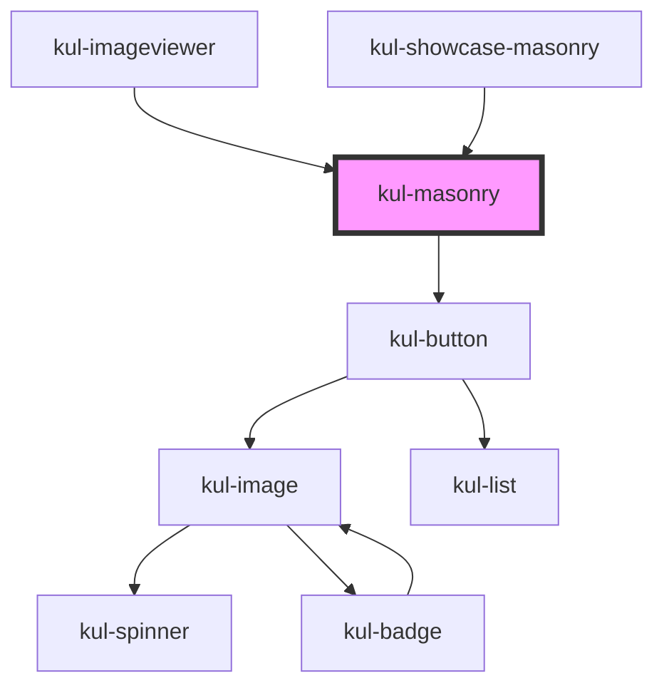

# kul-masonry

<!-- Auto Generated Below -->

## Properties

| Property        | Attribute        | Description                                                                                                                                       | Type                                                                                                                                                                                    | Default                |
| --------------- | ---------------- | ------------------------------------------------------------------------------------------------------------------------------------------------- | --------------------------------------------------------------------------------------------------------------------------------------------------------------------------------------- | ---------------------- |
| `kulColumns`    | `kul-columns`    | Number of columns of the masonry, doesn't affect sequential views. Can be set with a number or an array of numbers that identify each breakpoint. | `number \| number[]`                                                                                                                                                                    | `[...DEFAULT_COLUMNS]` |
| `kulData`       | --               | Actual data of the masonry.                                                                                                                       | `KulDataDataset`                                                                                                                                                                        | `null`                 |
| `kulSelectable` | `kul-selectable` | Allows for the selection of elements.                                                                                                             | `boolean`                                                                                                                                                                               | `false`                |
| `kulShape`      | `kul-shape`      | Sets the type of shapes to compare.                                                                                                               | `"badge" \| "button" \| "canvas" \| "card" \| "chart" \| "chat" \| "chip" \| "code" \| "image" \| "number" \| "photoframe" \| "slot" \| "text" \| "toggle" \| "typewriter" \| "upload"` | `"image"`              |
| `kulStyle`      | `kul-style`      | Custom style of the component.                                                                                                                    | `string`                                                                                                                                                                                | `""`                   |
| `kulView`       | `kul-view`       | Sets the type of view, either the actual masonry or a sequential view.                                                                            | `"horizontal" \| "masonry" \| "vertical"`                                                                                                                                               | `"masonry"`            |

## Events

| Event               | Description | Type                                  |
| ------------------- | ----------- | ------------------------------------- |
| `kul-masonry-event` |             | `CustomEvent<KulMasonryEventPayload>` |

## Methods

### `getDebugInfo() => Promise<KulDebugLifecycleInfo>`

Fetches debug information of the component's current state.

#### Returns

Type: `Promise<KulDebugLifecycleInfo>`

A promise that resolves with the debug information object.

### `getProps() => Promise<KulMasonryPropsInterface>`

Used to retrieve component's properties and descriptions.

#### Returns

Type: `Promise<KulMasonryPropsInterface>`

Promise resolved with an object containing the component's properties.

### `getSelectedShape() => Promise<KulMasonrySelectedShape>`

Returns the selected shape.

#### Returns

Type: `Promise<KulMasonrySelectedShape>`

Selected shape.

### `redecorateShapes() => Promise<void>`

Redecorates the shapes, updating potential new values.

#### Returns

Type: `Promise<void>`

### `refresh() => Promise<void>`

This method is used to trigger a new render of the component.

#### Returns

Type: `Promise<void>`

### `setSelectedShape(index: number) => Promise<void>`

Sets the selected shape by index.

#### Parameters

| Name    | Type     | Description |
| ------- | -------- | ----------- |
| `index` | `number` |             |

#### Returns

Type: `Promise<void>`

### `unmount(ms?: number) => Promise<void>`

Initiates the unmount sequence, which removes the component from the DOM after a delay.

#### Parameters

| Name | Type     | Description              |
| ---- | -------- | ------------------------ |
| `ms` | `number` | - Number of milliseconds |

#### Returns

Type: `Promise<void>`

## CSS Custom Properties

| Name                                         | Description                                                                    |
| -------------------------------------------- | ------------------------------------------------------------------------------ |
| `--kul-masonry-actions-z-index`              | Sets the z-index of action elements. Defaults to 2.                            |
| `--kul-masonry-button-bottom`                | Sets the bottom placement of the change view button. Defaults to 16px.         |
| `--kul-masonry-button-right`                 | Sets the right placement of the change view button. Defaults to 16px.          |
| `--kul-masonry-column-size`                  | Sets the dimension of the masonry columns. Defaults to minmax(0px, 1fr).       |
| `--kul-masonry-grid-gap`                     | Sets the gaps of the grid. Defaults to 8px.                                    |
| `--kul-masonry-grid-gap-actions`             | Sets the gap for action grids. Defaults to 8px.                                |
| `--kul-masonry-grid-gap-actions-sub`         | Sets the gap for sub-action grids. Defaults to 4px.                            |
| `--kul-masonry-grid-items-alignment`         | Sets the alignment of grid items. Defaults to start.                           |
| `--kul-masonry-hover-brightness`             | Sets the brightness on hover. Defaults to 125%.                                |
| `--kul-masonry-padding`                      | Sets the padding of the grid. Defaults to 12px.                                |
| `--kul-masonry-selected-after-border-radius` | Sets the border radius of the ::after pseudo-element. Defaults to 8px.         |
| `--kul-masonry-selected-after-border-width`  | Sets the border width of the ::after pseudo-element. Defaults to 4px.          |
| `--kul-masonry-selected-after-offset`        | Sets the offset for the ::after pseudo-element. Defaults to -4px.              |
| `--kul-masonry-selected-border`              | Sets the border color of selected items. Defaults to var(--kul-primary-color). |
| `--kul-masonry-selected-border-radius`       | Sets the border radius of selected items. Defaults to 5px.                     |
| `--kul-masonry-selected-box-shadow-blur`     | Sets the blur radius of the box-shadow. Defaults to 10px.                      |
| `--kul-masonry-selected-box-shadow-offset-y` | Sets the Y-offset of the box-shadow. Defaults to 4px.                          |
| `--kul-masonry-selected-outline-offset`      | Sets the outline offset of selected items. Defaults to 4px.                    |
| `--kul-masonry-selected-outline-width`       | Sets the outline width of selected items. Defaults to 2px.                     |
| `--kul-masonry-selected-transform-scale`     | Sets the scale transform of selected items. Defaults to 1.05.                  |
| `--kul-masonry-selected-z-index`             | Sets the z-index of selected items. Defaults to 1.                             |
| `--kul-masonry-transition-duration`          | Sets the duration of transitions. Defaults to 0.3s.                            |
| `--kul-masonry-transition-timing-function`   | Sets the timing function of transitions. Defaults to ease.                     |

## Dependencies

### Used by

 - [kul-imageviewer](../kul-imageviewer)
 - [kul-showcase-masonry](../kul-showcase/components/masonry)

### Depends on

- [kul-button](../kul-button)

### Graph

----------------------------------------------

*Built with [StencilJS](https://stenciljs.com/)*
