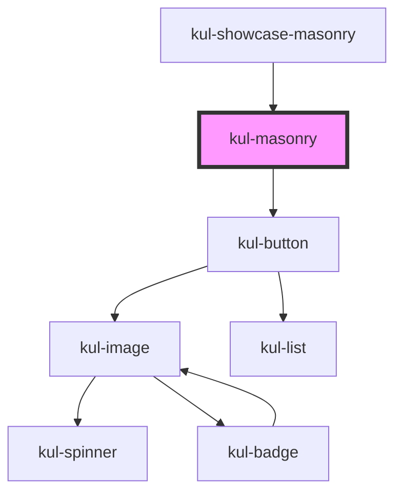

# kul-masonry

<!-- Auto Generated Below -->

## Properties

| Property        | Attribute        | Description                                                           | Type                                                                                                                              | Default     |
| --------------- | ---------------- | --------------------------------------------------------------------- | --------------------------------------------------------------------------------------------------------------------------------- | ----------- |
| `kulColumns`    | `kul-columns`    | Number of columns of the masonry.                                     | `number`                                                                                                                          | `4`         |
| `kulData`       | --               | Actual data of the masonry.                                           | `KulDataDataset`                                                                                                                  | `null`      |
| `kulSelectable` | `kul-selectable` | Allows for the selection of elements.                                 | `boolean`                                                                                                                         | `false`     |
| `kulShape`      | `kul-shape`      | Sets the type of shapes to compare.                                   | `"badge" \| "button" \| "card" \| "chart" \| "chat" \| "chip" \| "code" \| "image" \| "number" \| "switch" \| "text" \| "upload"` | `'image'`   |
| `kulStyle`      | `kul-style`      | Custom style of the component.                                        | `string`                                                                                                                          | `''`        |
| `kulView`       | `kul-view`       | Sets the type of view, either the actual masonry or a waterfall view. | `"masonry" \| "waterfall"`                                                                                                        | `'masonry'` |

## Events

| Event               | Description              | Type                                  |
| ------------------- | ------------------------ | ------------------------------------- |
| `kul-masonry-event` | Describes event emitted. | `CustomEvent<KulMasonryEventPayload>` |

## Methods

### `getDebugInfo() => Promise<KulDebugLifecycleInfo>`

Fetches debug information of the component's current state.

#### Returns

Type: `Promise<KulDebugLifecycleInfo>`

A promise that resolves with the debug information object.

### `getProps(descriptions?: boolean) => Promise<GenericObject>`

Used to retrieve component's properties and descriptions.

#### Parameters

| Name           | Type      | Description                                           |
| -------------- | --------- | ----------------------------------------------------- |
| `descriptions` | `boolean` | - When true, includes descriptions for each property. |

#### Returns

Type: `Promise<GenericObject<unknown>>`

Promise resolved with an object containing the component's properties.

### `refresh() => Promise<void>`

This method is used to trigger a new render of the component.

#### Returns

Type: `Promise<void>`

### `unmount(ms?: number) => Promise<void>`

Initiates the unmount sequence, which removes the component from the DOM after a delay.

#### Parameters

| Name | Type     | Description              |
| ---- | -------- | ------------------------ |
| `ms` | `number` | - Number of milliseconds |

#### Returns

Type: `Promise<void>`

## CSS Custom Properties

| Name                          | Description                                                              |
| ----------------------------- | ------------------------------------------------------------------------ |
| `--kul-masonry-button-bottom` | Sets the bottom placement of the change view button. Defaults to 30px.   |
| `--kul-masonry-button-right`  | Sets the right placement of the change view button. Defaults to 30px.    |
| `--kul-masonry-column-size`   | Sets the dimension of the masonry columns. Defaults to minmax(0px, 1fr). |
| `--kul-masonry-grid-gap`      | Sets the gaps of the grid. Defaults to 8px.                              |

## Dependencies

### Used by

 - [kul-showcase-masonry](../kul-showcase/components/masonry)

### Depends on

- [kul-button](../kul-button)

### Graph

----------------------------------------------

*Built with [StencilJS](https://stenciljs.com/)*
