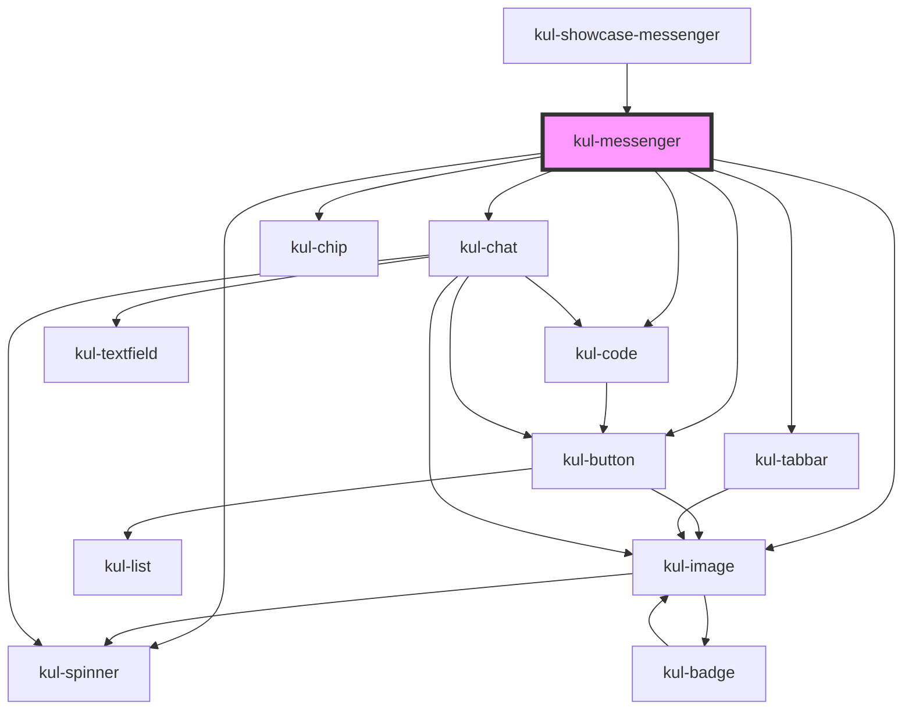

# kul-messenger

<!-- Auto Generated Below -->

## Properties

| Property   | Attribute   | Description                                                                                                   | Type                         | Default |
| ---------- | ----------- | ------------------------------------------------------------------------------------------------------------- | ---------------------------- | ------- |
| `kulData`  | --          | The data of the messenger.                                                                                    | `KulMessengerDataset`        | `null`  |
| `kulStyle` | `kul-style` | Customizes the style of the component. This property allows you to apply a custom CSS style to the component. | `string`                     | `''`    |
| `kulValue` | --          | Customizes the style of the component. This property allows you to apply a custom CSS style to the component. | `KulMessengerInitialization` | `null`  |

## Events

| Event                 | Description              | Type                                    |
| --------------------- | ------------------------ | --------------------------------------- |
| `kul-messenger-event` | Describes event emitted. | `CustomEvent<KulMessengerEventPayload>` |

## Methods

### `getDebugInfo() => Promise<KulDebugComponentInfo>`

Fetches debug information of the component's current state.

#### Returns

Type: `Promise<KulDebugComponentInfo>`

A promise that resolves with the debug information object.

### `getProps(descriptions?: boolean) => Promise<GenericObject>`

Used to retrieve component's props values.

#### Parameters

| Name           | Type      | Description                                                                            |
| -------------- | --------- | -------------------------------------------------------------------------------------- |
| `descriptions` | `boolean` | - When provided and true, the result will be the list of props with their description. |

#### Returns

Type: `Promise<GenericObject<unknown>>`

List of props as object, each key will be a prop.

### `refresh() => Promise<void>`

This method is used to trigger a new render of the component.

#### Returns

Type: `Promise<void>`

### `reset() => Promise<void>`

Resets the states of the component.

#### Returns

Type: `Promise<void>`

## CSS Custom Properties

| Name                                    | Description                                                                            |
| --------------------------------------- | -------------------------------------------------------------------------------------- |
| `--kul-messenger-background-color`      | Sets the background color. Defaults to var(--kul-background-color).                    |
| `--kul-messenger-font-size`             | Sets the font size of the component. Defaults to var(--kul-font-size).                 |
| `--kul-messenger-name-background-color` | Sets the color of text. Defaults to rgba(var(--kul-title-background-color-rgb), 0.75). |
| `--kul-messenger-text-color`            | Sets the color of text. Defaults to var(--kul-text-color).                             |

## Dependencies

### Used by

 - [kul-showcase-messenger](../kul-showcase/layout/messenger)

### Depends on

- [kul-image](../kul-image)
- [kul-button](../kul-button)
- [kul-spinner](../kul-spinner)
- [kul-code](../kul-code)
- [kul-tabbar](../kul-tabbar)
- [kul-chat](../kul-chat)
- [kul-chip](../kul-chip)

### Graph

----------------------------------------------

*Built with [StencilJS](https://stenciljs.com/)*
