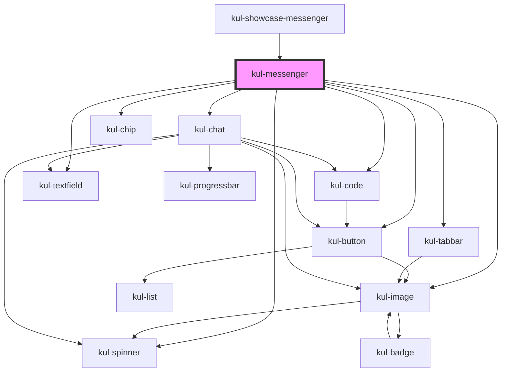

# kul-messenger

<!-- Auto Generated Below -->

## Properties

| Property      | Attribute      | Description                                                                                                   | Type                  | Default |
| ------------- | -------------- | ------------------------------------------------------------------------------------------------------------- | --------------------- | ------- |
| `kulAutosave` | `kul-autosave` | Automatically saves the dataset when a chat updates.                                                          | `boolean`             | `true`  |
| `kulData`     | --             | The data of the messenger.                                                                                    | `KulMessengerDataset` | `null`  |
| `kulStyle`    | `kul-style`    | Customizes the style of the component. This property allows you to apply a custom CSS style to the component. | `string`              | `''`    |
| `kulValue`    | --             | Sets the initial configuration, including active character and filters.                                       | `KulMessengerConfig`  | `null`  |

## Events

| Event                 | Description              | Type                                    |
| --------------------- | ------------------------ | --------------------------------------- |
| `kul-messenger-event` | Describes event emitted. | `CustomEvent<KulMessengerEventPayload>` |

## Methods

### `getDebugInfo() => Promise<KulDebugComponentInfo>`

Fetches debug information of the component's current state.

#### Returns

Type: `Promise<KulDebugComponentInfo>`

A promise that resolves with the debug information object.

### `getProps(descriptions?: boolean) => Promise<GenericObject>`

Used to retrieve component's props values.

#### Parameters

| Name           | Type      | Description                                                                            |
| -------------- | --------- | -------------------------------------------------------------------------------------- |
| `descriptions` | `boolean` | - When provided and true, the result will be the list of props with their description. |

#### Returns

Type: `Promise<GenericObject<unknown>>`

List of props as object, each key will be a prop.

### `refresh() => Promise<void>`

This method is used to trigger a new render of the component.

#### Returns

Type: `Promise<void>`

### `reset() => Promise<void>`

Resets the states of the component.

#### Returns

Type: `Promise<void>`

## CSS Custom Properties

| Name                                          | Description                                                                                                                |
| --------------------------------------------- | -------------------------------------------------------------------------------------------------------------------------- |
| `--kul-messenger-active-options-name-padding` | Sets the padding of active options' names. Defaults to 4px.                                                                |
| `--kul-messenger-avatar-name-padding`         | Sets the padding of the avatar's name. Defaults to 12px.                                                                   |
| `--kul-messenger-backdrop-filter`             | Sets the backdrop filter. Defaults to 5px.                                                                                 |
| `--kul-messenger-background-color`            | Sets the background color. Defaults to var(--kul-background-color).                                                        |
| `--kul-messenger-customization-title-padding` | Sets the padding of customization panel titles. Defaults to 8px 12px.                                                      |
| `--kul-messenger-font-size`                   | Sets the font size of the component. Defaults to var(--kul-font-size).                                                     |
| `--kul-messenger-letter-spacing`              | Sets the letter spacing. Defaults to 5px.                                                                                  |
| `--kul-messenger-name-background-color`       | Sets the color of text. Defaults to rgba(var(--kul-title-background-color-rgb), 0.75).                                     |
| `--kul-messenger-name-height`                 | Sets the height of the character's name. Defaults to 50px.                                                                 |
| `--kul-messenger-nav-box-shadow`              | Sets the box shadow of the messenger's navigation bar. Defaults to 0px 1px 7px 3px rgba(var(--kul-text-color-rgb), 0.375). |
| `--kul-messenger-text-color`                  | Sets the color of text. Defaults to var(--kul-text-color).                                                                 |
| `--kul-messenger-transition`                  | Sets the transition effect. Defaults to 125ms ease-out.                                                                    |

## Dependencies

### Used by

 - [kul-showcase-messenger](../kul-showcase/components/messenger)

### Depends on

- [kul-image](../kul-image)
- [kul-button](../kul-button)
- [kul-spinner](../kul-spinner)
- [kul-code](../kul-code)
- [kul-tabbar](../kul-tabbar)
- [kul-chat](../kul-chat)
- [kul-chip](../kul-chip)
- [kul-textfield](../kul-textfield)

### Graph

----------------------------------------------

*Built with [StencilJS](https://stenciljs.com/)*
