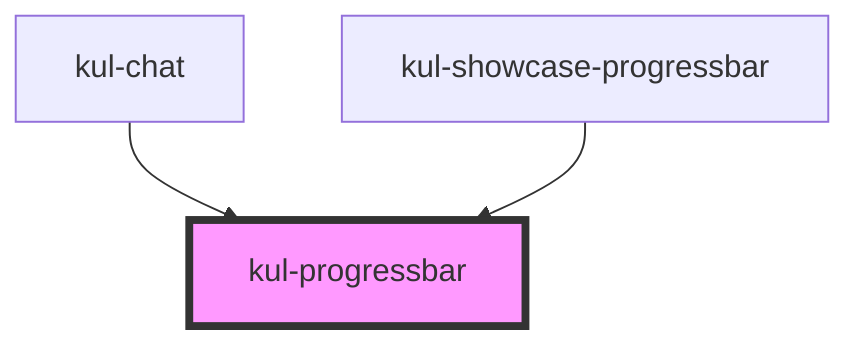

# kul-progressbar

<!-- Auto Generated Below -->

## Properties

| Property           | Attribute            | Description                                                                                                         | Type      | Default |
| ------------------ | -------------------- | ------------------------------------------------------------------------------------------------------------------- | --------- | ------- |
| `kulCenteredLabel` | `kul-centered-label` | Displays the label in the middle of the progress bar. It's the default for the radial variant and can't be changed. | `boolean` | `false` |
| `kulIcon`          | `kul-icon`           | Specifies an icon to replace the label.                                                                             | `string`  | `''`    |
| `kulIsRadial`      | `kul-is-radial`      | Radial version.                                                                                                     | `boolean` | `false` |
| `kulLabel`         | `kul-label`          | Specifies a text for the bar's label.                                                                               | `string`  | `''`    |
| `kulStyle`         | `kul-style`          | Custom style of the component.                                                                                      | `string`  | `''`    |
| `kulValue`         | `kul-value`          | The current value the progress bar must display.                                                                    | `number`  | `0`     |

## Events

| Event                   | Description              | Type                                                                               |
| ----------------------- | ------------------------ | ---------------------------------------------------------------------------------- |
| `kul-progressbar-event` | Describes event emitted. | `CustomEvent<KulEventPayload<KulProgressbar, "ready", Event \| CustomEvent<any>>>` |

## Methods

### `getDebugInfo() => Promise<KulDebugComponentInfo>`

Retrieves the debug information reflecting the current state of the component.

#### Returns

Type: `Promise<KulDebugComponentInfo>`

A promise that resolves to a KulDebugComponentInfo object containing debug information.

### `getProps(descriptions?: boolean) => Promise<GenericObject>`

Retrieves the properties of the component, with optional descriptions.

#### Parameters

| Name           | Type      | Description                                                                          |
| -------------- | --------- | ------------------------------------------------------------------------------------ |
| `descriptions` | `boolean` | - If true, returns properties with descriptions; otherwise, returns properties only. |

#### Returns

Type: `Promise<GenericObject<unknown>>`

A promise that resolves to an object where each key is a property name, optionally with its description.

### `refresh() => Promise<void>`

Triggers a re-render of the component to reflect any state changes.

#### Returns

Type: `Promise<void>`

## CSS Custom Properties

| Name                                      | Description                                                                                                     |
| ----------------------------------------- | --------------------------------------------------------------------------------------------------------------- |
| `--kul-progressbar-border-radius`         | Sets border radius of the component. Defaults to 4px.                                                           |
| `--kul-progressbar-font-family`           | Sets font family of the component. Defaults to the value of --kul-font-family.                                  |
| `--kul-progressbar-font-size`             | Sets font size of the component. Defaults to the value of --kul-font-size.                                      |
| `--kul-progressbar-height`                | Sets height of the component. Defaults to 1.25em.                                                               |
| `--kul-progressbar-primary-color`         | Sets primary color of the component. Defaults to the value of --kul-primary-color.                              |
| `--kul-progressbar-text-color`            | Sets text color of the component. Defaults to the value of --kul-text-color.                                    |
| `--kul-progressbar-text-color-rgb`        | Sets text color RGB values of the component (used for shaders). Defaults to the value of --kul-text-color-rgb.  |
| `--kul-progressbar-text-on-primary-color` | Sets text on primary color of the component. Defaults to the value of --kul-text-on-primary-color.              |
| `--kul-progressbar-track-color`           | Sets track color of the progress bar (empty section). Defaults to the value of --kul-disabled-background-color. |
| `--kul-progressbar-width`                 | Sets width of the component. Defaults to 100%.                                                                  |

## Dependencies

### Used by

 - [kul-chat](../kul-chat)
 - [kul-showcase-progressbar](../kul-showcase/components/progressbar)

### Graph

----------------------------------------------

*Built with [StencilJS](https://stenciljs.com/)*
