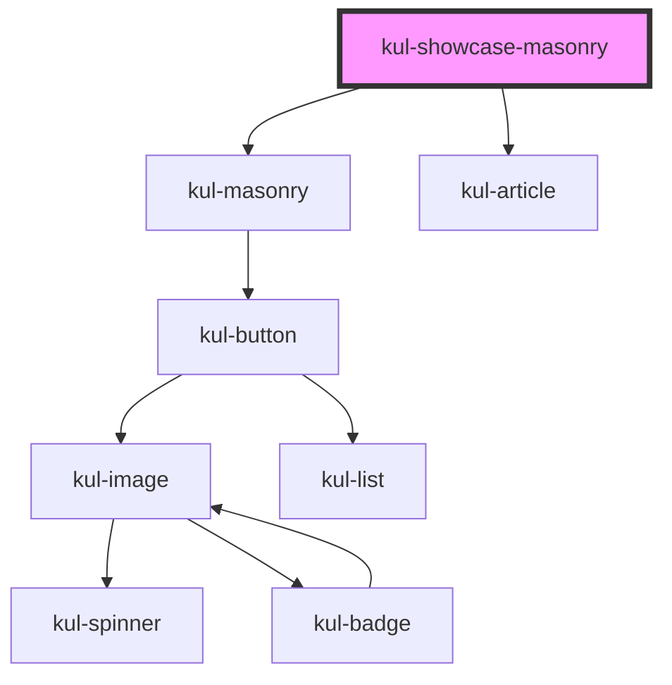

# kul-showcase-masonry

<!-- Auto Generated Below -->

## Shadow Parts

| Part               | Description |
| ------------------ | ----------- |
| `"comp-wrapper"`   |             |
| `"description"`    |             |
| `"example"`        |             |
| `"examples-title"` |             |
| `"grid"`           |             |

## Dependencies

### Depends on

- [kul-masonry](../../../kul-masonry)
- [kul-article](../../../kul-article)

### Graph

---

_Built with [StencilJS](https://stenciljs.com/)_
