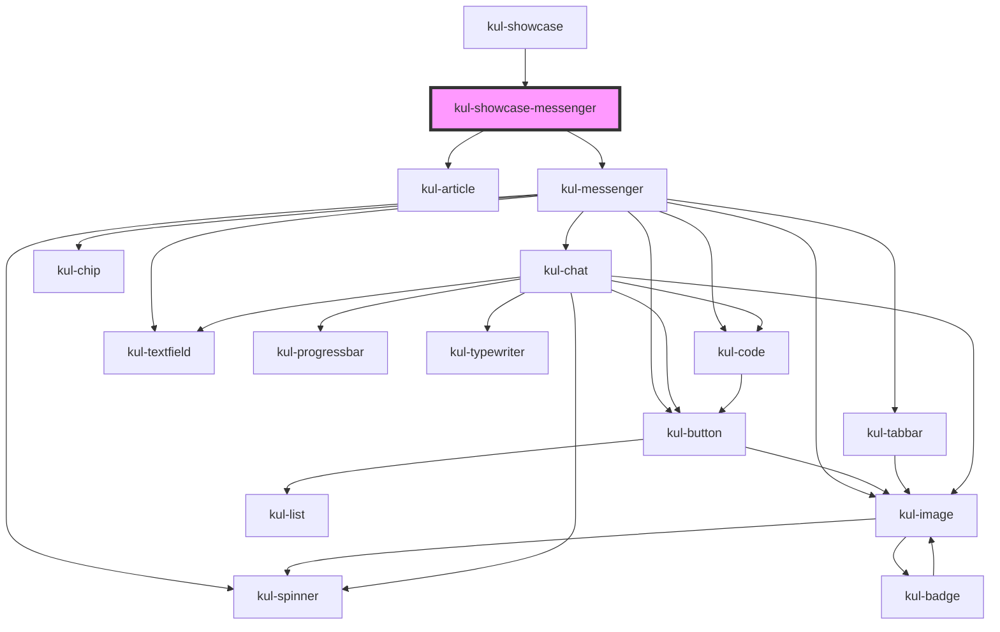

# kul-showcase-messenger

<!-- Auto Generated Below -->

## Shadow Parts

| Part               | Description |
| ------------------ | ----------- |
| `"examples-title"` |             |
| `"grid"`           |             |

## Dependencies

### Used by

 - [kul-showcase](../..)

### Depends on

- [kul-article](../../../kul-article)
- [kul-messenger](../../../kul-messenger)

### Graph

----------------------------------------------

*Built with [StencilJS](https://stenciljs.com/)*
