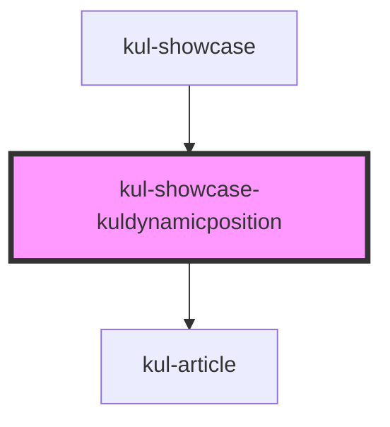

# kul-showcase-kuldynamicposition

<!-- Auto Generated Below -->

## Dependencies

### Used by

 - [kul-showcase](../..)

### Depends on

- [kul-article](../../../kul-article)

### Graph

----------------------------------------------

*Built with [StencilJS](https://stenciljs.com/)*
