# kul-showcase

<!-- Auto Generated Below -->

## Properties

| Property           | Attribute   | Description                                                                                                   | Type          | Default     |
| ------------------ | ----------- | ------------------------------------------------------------------------------------------------------------- | ------------- | ----------- |
| `kulScrollElement` | --          | Customizes the style of the component. This property allows you to apply a custom CSS style to the component. | `HTMLElement` | `undefined` |
| `kulStyle`         | `kul-style` | Customizes the style of the component. This property allows you to apply a custom CSS style to the component. | `string`      | `""`        |

## Dependencies

### Depends on

- [kul-article](../kul-article)
- [kul-button](../kul-button)
- [kul-typewriter](../kul-typewriter)
- [kul-showcase-accordion](./components/accordion)
- [kul-showcase-article](./components/article)
- [kul-showcase-badge](./components/badge)
- [kul-showcase-button](./components/button)
- [kul-showcase-canvas](./components/canvas)
- [kul-showcase-card](./components/card)
- [kul-showcase-carousel](./components/carousel)
- [kul-showcase-chart](./components/chart)
- [kul-showcase-chat](./components/chat)
- [kul-showcase-chip](./components/chip)
- [kul-showcase-code](./components/code)
- [kul-showcase-compare](./components/compare)
- [kul-showcase-drawer](./components/drawer)
- [kul-showcase-header](./components/header)
- [kul-showcase-image](./components/image)
- [kul-showcase-imageviewer](./components/imageviewer)
- [kul-showcase-lazy](./components/lazy)
- [kul-showcase-list](./components/list)
- [kul-showcase-masonry](./components/masonry)
- [kul-showcase-messenger](./components/messenger)
- [kul-showcase-photoframe](./components/photoframe)
- [kul-showcase-progressbar](./components/progressbar)
- [kul-showcase-slider](./components/slider)
- [kul-showcase-splash](./components/splash)
- [kul-showcase-spinner](./components/spinner)
- [kul-showcase-tabbar](./components/tabbar)
- [kul-showcase-textfield](./components/textfield)
- [kul-showcase-toast](./components/toast)
- [kul-showcase-toggle](./components/toggle)
- [kul-showcase-tree](./components/tree)
- [kul-showcase-typewriter](./components/typewriter)
- [kul-showcase-upload](./components/upload)
- [kul-showcase-kuldata](./framework/data)
- [kul-showcase-kuldates](./framework/dates)
- [kul-showcase-kuldebug](./framework/debug)
- [kul-showcase-kuldynamicposition](./framework/dynamicposition)
- [kul-showcase-kullanguage](./framework/language)
- [kul-showcase-kulllm](./framework/llm)
- [kul-showcase-kulmanager](./framework/manager)
- [kul-showcase-kulscrollonhover](./framework/scroll-on-hover)
- [kul-showcase-kultheme](./framework/theme)
- [kul-showcase-debug](./utilities/debug)
- [kul-card](../kul-card)

### Graph

```mermaid
graph TD;
  kul-showcase --> kul-article
  kul-showcase --> kul-button
  kul-showcase --> kul-typewriter
  kul-showcase --> kul-showcase-accordion
  kul-showcase --> kul-showcase-article
  kul-showcase --> kul-showcase-badge
  kul-showcase --> kul-showcase-button
  kul-showcase --> kul-showcase-canvas
  kul-showcase --> kul-showcase-card
  kul-showcase --> kul-showcase-carousel
  kul-showcase --> kul-showcase-chart
  kul-showcase --> kul-showcase-chat
  kul-showcase --> kul-showcase-chip
  kul-showcase --> kul-showcase-code
  kul-showcase --> kul-showcase-compare
  kul-showcase --> kul-showcase-drawer
  kul-showcase --> kul-showcase-header
  kul-showcase --> kul-showcase-image
  kul-showcase --> kul-showcase-imageviewer
  kul-showcase --> kul-showcase-lazy
  kul-showcase --> kul-showcase-list
  kul-showcase --> kul-showcase-masonry
  kul-showcase --> kul-showcase-messenger
  kul-showcase --> kul-showcase-photoframe
  kul-showcase --> kul-showcase-progressbar
  kul-showcase --> kul-showcase-slider
  kul-showcase --> kul-showcase-splash
  kul-showcase --> kul-showcase-spinner
  kul-showcase --> kul-showcase-tabbar
  kul-showcase --> kul-showcase-textfield
  kul-showcase --> kul-showcase-toast
  kul-showcase --> kul-showcase-toggle
  kul-showcase --> kul-showcase-tree
  kul-showcase --> kul-showcase-typewriter
  kul-showcase --> kul-showcase-upload
  kul-showcase --> kul-showcase-kuldata
  kul-showcase --> kul-showcase-kuldates
  kul-showcase --> kul-showcase-kuldebug
  kul-showcase --> kul-showcase-kuldynamicposition
  kul-showcase --> kul-showcase-kullanguage
  kul-showcase --> kul-showcase-kulllm
  kul-showcase --> kul-showcase-kulmanager
  kul-showcase --> kul-showcase-kulscrollonhover
  kul-showcase --> kul-showcase-kultheme
  kul-showcase --> kul-showcase-debug
  kul-showcase --> kul-card
  kul-button --> kul-image
  kul-button --> kul-list
  kul-image --> kul-spinner
  kul-image --> kul-badge
  kul-badge --> kul-image
  kul-showcase-accordion --> kul-article
  kul-showcase-accordion --> kul-accordion
  kul-showcase-article --> kul-article
  kul-showcase-badge --> kul-article
  kul-showcase-badge --> kul-badge
  kul-showcase-button --> kul-article
  kul-showcase-button --> kul-button
  kul-showcase-button --> kul-spinner
  kul-showcase-canvas --> kul-article
  kul-showcase-canvas --> kul-canvas
  kul-canvas --> kul-image
  kul-showcase-card --> kul-article
  kul-showcase-card --> kul-card
  kul-showcase-carousel --> kul-article
  kul-showcase-carousel --> kul-carousel
  kul-carousel --> kul-button
  kul-showcase-chart --> kul-article
  kul-showcase-chart --> kul-chart
  kul-showcase-chat --> kul-article
  kul-showcase-chat --> kul-chat
  kul-chat --> kul-spinner
  kul-chat --> kul-typewriter
  kul-chat --> kul-code
  kul-chat --> kul-image
  kul-chat --> kul-button
  kul-chat --> kul-progressbar
  kul-chat --> kul-textfield
  kul-code --> kul-button
  kul-showcase-chip --> kul-article
  kul-showcase-chip --> kul-chip
  kul-showcase-code --> kul-article
  kul-showcase-code --> kul-code
  kul-showcase-compare --> kul-article
  kul-showcase-compare --> kul-compare
  kul-compare --> kul-button
  kul-compare --> kul-tree
  kul-tree --> kul-textfield
  kul-showcase-drawer --> kul-article
  kul-showcase-header --> kul-article
  kul-showcase-image --> kul-article
  kul-showcase-image --> kul-image
  kul-showcase-imageviewer --> kul-article
  kul-showcase-imageviewer --> kul-imageviewer
  kul-imageviewer --> kul-canvas
  kul-imageviewer --> kul-button
  kul-imageviewer --> kul-spinner
  kul-imageviewer --> kul-masonry
  kul-imageviewer --> kul-textfield
  kul-imageviewer --> kul-tree
  kul-masonry --> kul-button
  kul-showcase-lazy --> kul-article
  kul-showcase-lazy --> kul-lazy
  kul-showcase-list --> kul-article
  kul-showcase-list --> kul-list
  kul-showcase-masonry --> kul-article
  kul-showcase-masonry --> kul-masonry
  kul-showcase-messenger --> kul-article
  kul-showcase-messenger --> kul-messenger
  kul-messenger --> kul-button
  kul-messenger --> kul-tabbar
  kul-messenger --> kul-chat
  kul-messenger --> kul-image
  kul-messenger --> kul-spinner
  kul-messenger --> kul-code
  kul-messenger --> kul-chip
  kul-messenger --> kul-textfield
  kul-tabbar --> kul-image
  kul-showcase-photoframe --> kul-article
  kul-showcase-photoframe --> kul-photoframe
  kul-showcase-progressbar --> kul-article
  kul-showcase-progressbar --> kul-progressbar
  kul-showcase-slider --> kul-article
  kul-showcase-slider --> kul-slider
  kul-showcase-splash --> kul-article
  kul-showcase-splash --> kul-button
  kul-showcase-splash --> kul-splash
  kul-showcase-splash --> kul-spinner
  kul-showcase-spinner --> kul-article
  kul-showcase-spinner --> kul-spinner
  kul-showcase-tabbar --> kul-article
  kul-showcase-tabbar --> kul-tabbar
  kul-showcase-textfield --> kul-article
  kul-showcase-textfield --> kul-textfield
  kul-showcase-toast --> kul-article
  kul-showcase-toast --> kul-toast
  kul-toast --> kul-image
  kul-showcase-toggle --> kul-article
  kul-showcase-toggle --> kul-toggle
  kul-showcase-tree --> kul-article
  kul-showcase-tree --> kul-tree
  kul-showcase-typewriter --> kul-article
  kul-showcase-typewriter --> kul-typewriter
  kul-showcase-upload --> kul-article
  kul-showcase-upload --> kul-upload
  kul-upload --> kul-image
  kul-upload --> kul-button
  kul-showcase-kuldata --> kul-article
  kul-showcase-kuldates --> kul-article
  kul-showcase-kuldebug --> kul-article
  kul-showcase-kuldynamicposition --> kul-article
  kul-showcase-kullanguage --> kul-article
  kul-showcase-kulllm --> kul-article
  kul-showcase-kulmanager --> kul-article
  kul-showcase-kulscrollonhover --> kul-article
  kul-showcase-kultheme --> kul-article
  kul-showcase-debug --> kul-article
  kul-showcase-debug --> kul-textfield
  style kul-showcase fill:#f9f,stroke:#333,stroke-width:4px
```

----------------------------------------------

*Built with [StencilJS](https://stenciljs.com/)*
