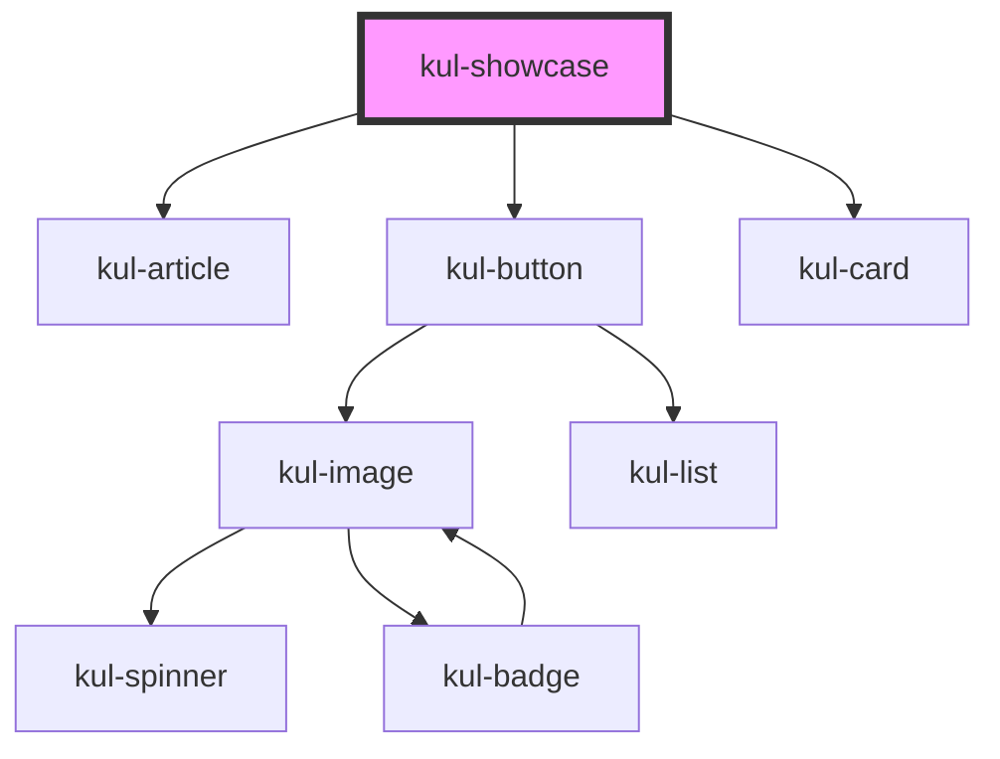

# kul-showcase

<!-- Auto Generated Below -->

## Properties

| Property   | Attribute   | Description                    | Type     | Default |
| ---------- | ----------- | ------------------------------ | -------- | ------- |
| `kulStyle` | `kul-style` | Custom style of the component. | `string` | `""`    |

## Dependencies

### Depends on

- [kul-article](../kul-article)
- [kul-button](../kul-button)
- [kul-card](../kul-card)

### Graph

----------------------------------------------

*Built with [StencilJS](https://stenciljs.com/)*
