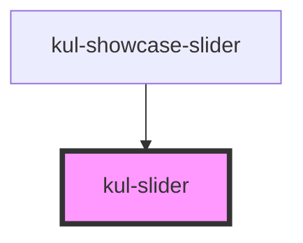

# kul-button

<!-- Auto Generated Below -->

## Properties

| Property          | Attribute           | Description                                                                     | Type      | Default |
| ----------------- | ------------------- | ------------------------------------------------------------------------------- | --------- | ------- |
| `kulDisabled`     | `kul-disabled`      | When true, the component is disabled, preventing user interaction.              | `boolean` | `false` |
| `kulLabel`        | `kul-label`         | Defines text to display as a label for the slider.                              | `string`  | `""`    |
| `kulLeadingLabel` | `kul-leading-label` | When true, displays the label before the slider component. Defaults to `false`. | `boolean` | `false` |
| `kulMax`          | `kul-max`           | The maximum value allowed by the slider.                                        | `number`  | `100`   |
| `kulMin`          | `kul-min`           | The minimum value allowed by the slider.                                        | `number`  | `0`     |
| `kulRipple`       | `kul-ripple`        | Adds a ripple effect when interacting with the slider.                          | `boolean` | `true`  |
| `kulStep`         | `kul-step`          | Sets the increment or decrement steps when moving the slider.                   | `number`  | `1`     |
| `kulStyle`        | `kul-style`         | Custom CSS style to apply to the slider component.                              | `string`  | `""`    |
| `kulValue`        | `kul-value`         | The initial numeric value for the slider within the defined range.              | `number`  | `50`    |

## Events

| Event              | Description | Type                                 |
| ------------------ | ----------- | ------------------------------------ |
| `kul-slider-event` |             | `CustomEvent<KulSliderEventPayload>` |

## Methods

### `getDebugInfo() => Promise<KulDebugLifecycleInfo>`

Fetches debug information of the component's current state.

#### Returns

Type: `Promise<KulDebugLifecycleInfo>`

A promise that resolves with the debug information object.

### `getProps() => Promise<GenericObject>`

Used to retrieve component's properties and descriptions.

#### Returns

Type: `Promise<GenericObject<unknown>>`

Promise resolved with an object containing the component's properties.

### `getValue() => Promise<KulSliderValue>`

Used to retrieve the component's current state.

#### Returns

Type: `Promise<KulSliderValue>`

Promise resolved with the current state of the component.

### `refresh() => Promise<void>`

This method is used to trigger a new render of the component.

#### Returns

Type: `Promise<void>`

### `setValue(value: number) => Promise<void>`

Sets the component's state.

#### Parameters

| Name    | Type     | Description                                 |
| ------- | -------- | ------------------------------------------- |
| `value` | `number` | - The new state to be set on the component. |

#### Returns

Type: `Promise<void>`

### `unmount(ms?: number) => Promise<void>`

Initiates the unmount sequence, which removes the component from the DOM after a delay.

#### Parameters

| Name | Type     | Description              |
| ---- | -------- | ------------------------ |
| `ms` | `number` | - Number of milliseconds |

#### Returns

Type: `Promise<void>`

## CSS Custom Properties

| Name                                        | Description                                                                                                                                            |
| ------------------------------------------- | ------------------------------------------------------------------------------------------------------------------------------------------------------ |
| `--kul-slider-backdrop-filter`              | Sets backdrop filter effect for the track and thumb underlay. Defaults to blur(10px).                                                                  |
| `--kul-slider-box-shadow`                   | Sets box shadow for the slider components. Defaults to 0px 4px 8px rgba(0, 0, 0, 0.2).                                                                 |
| `--kul-slider-disabled-opacity`             | Sets opacity of the slider when disabled. Defaults to 0.5.                                                                                             |
| `--kul-slider-font-family`                  | Sets font family of the slider's label. Defaults to var(--kul-font-family).                                                                            |
| `--kul-slider-font-size`                    | Sets font size of the slider's label. Defaults to var(--kul-font-size).                                                                                |
| `--kul-slider-font-weight`                  | Sets font weight of the slider's label. Defaults to 400.                                                                                               |
| `--kul-slider-input-height`                 | Sets the height of the hidden input element. Defaults to 48px.                                                                                         |
| `--kul-slider-label-color`                  | Sets text color of the slider's label. Defaults to var(--kul-text-color).                                                                              |
| `--kul-slider-label-font-size`              | Sets font size of the slider's label. Defaults to 0.875em.                                                                                             |
| `--kul-slider-label-letter-spacing`         | Sets letter spacing of the slider's label. Defaults to 0.0178571429em.                                                                                 |
| `--kul-slider-label-line-height`            | Sets line height of the slider's label. Defaults to 2em.                                                                                               |
| `--kul-slider-label-min-width`              | Sets the min. width of the label. Defaults to 0px.                                                                                                     |
| `--kul-slider-label-overflow`               | Sets the behavior of the label's overflow. Defaults to unset.                                                                                          |
| `--kul-slider-label-padding-left`           | Sets left padding of the slider's label. Defaults to 8px.                                                                                              |
| `--kul-slider-label-padding-right`          | Sets right padding of the slider's label. Defaults to 8px.                                                                                             |
| `--kul-slider-label-white-space`            | Sets the behavior of the label's white spaces. Defaults to pre-wrap.                                                                                   |
| `--kul-slider-margin`                       | Sets margin around the slider component. Defaults to 0 0.75em.                                                                                         |
| `--kul-slider-min-width`                    | Sets minimum width of the slider component. Defaults to 128px.                                                                                         |
| `--kul-slider-primary-color`                | Sets primary color of the component. Used for active parts of the slider such as the track and thumb. Defaults to var(--kul-primary-color).            |
| `--kul-slider-primary-color-rgb`            | Sets primary color RGB values for the component. Used to create transparent variations of the primary color. Defaults to var(--kul-primary-color-rgb). |
| `--kul-slider-thumb-active-after-scale`     | Sets scale transform on active state for the thumb's after element. Defaults to 1.5.                                                                   |
| `--kul-slider-thumb-backdrop-filter`        | Sets backdrop filter for the thumb underlay. Defaults to blur(10px).                                                                                   |
| `--kul-slider-thumb-backdrop-filter-active` | Sets backdrop filter for the active thumb. Defaults to blur(12px).                                                                                     |
| `--kul-slider-thumb-border-radius`          | Sets border radius of the slider thumb. Defaults to 50%.                                                                                               |
| `--kul-slider-thumb-box-shadow`             | Sets box shadow for the slider thumb. Defaults to 0px 4px 8px rgba(0, 0, 0, 0.2).                                                                      |
| `--kul-slider-thumb-color`                  | Sets color of the slider thumb. Defaults to var(--kul-border-color).                                                                                   |
| `--kul-slider-thumb-height`                 | Sets height of the slider thumb. Defaults to 24px.                                                                                                     |
| `--kul-slider-thumb-hover-scale`            | Sets scale transform on hover for the thumb. Defaults to 1.1.                                                                                          |
| `--kul-slider-thumb-underlay-top`           | Sets top position of the thumb underlay. Defaults to -9px.                                                                                             |
| `--kul-slider-thumb-width`                  | Sets width of the slider thumb. Defaults to 24px.                                                                                                      |
| `--kul-slider-track-border-radius`          | Sets border radius of the slider track. Defaults to 12px.                                                                                              |
| `--kul-slider-track-height`                 | Sets height of the slider track. Defaults to 6px.                                                                                                      |
| `--kul-slider-transition-duration`          | Sets duration of transitions. Defaults to 0.3s.                                                                                                        |
| `--kul-slider-value-bottom-position`        | Sets the bottom position of the value display. Defaults to -3em.                                                                                       |
| `--kul-slider-value-font-size`              | Sets font size of the slider's value display. Defaults to 0.875em.                                                                                     |
| `--kul-slider-value-font-weight`            | Sets font weight of the slider's value display. Defaults to 500.                                                                                       |

## Dependencies

### Used by

 - [kul-showcase-slider](../kul-showcase/components/slider)

### Graph

----------------------------------------------

*Built with [StencilJS](https://stenciljs.com/)*
