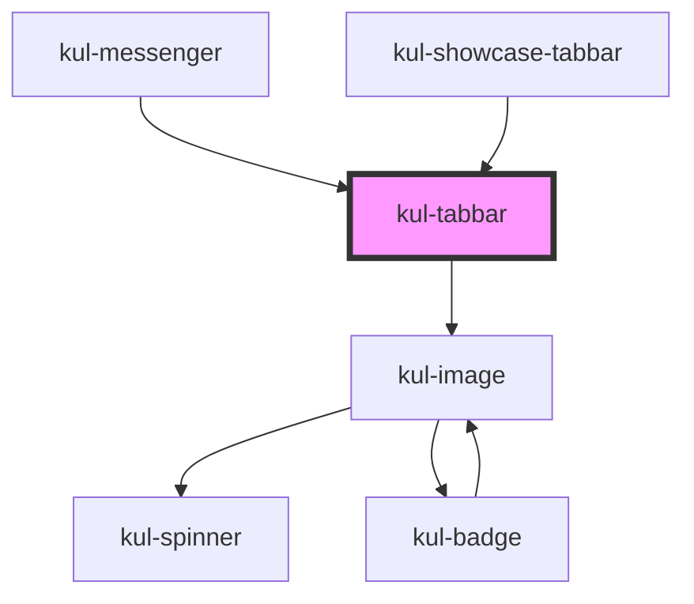

# kul-tabbar

<!-- Auto Generated Below -->

## Properties

| Property    | Attribute    | Description                                                           | Type               | Default |
| ----------- | ------------ | --------------------------------------------------------------------- | ------------------ | ------- |
| `kulData`   | --           | Actual data of the component.                                         | `KulDataDataset`   | `null`  |
| `kulRipple` | `kul-ripple` | When set to true, the pointerdown event will trigger a ripple effect. | `boolean`          | `true`  |
| `kulStyle`  | `kul-style`  | Custom style of the component.                                        | `string`           | `""`    |
| `kulValue`  | `kul-value`  | Sets the initial selected node's index.                               | `number \| string` | `0`     |

## Events

| Event              | Description | Type                                 |
| ------------------ | ----------- | ------------------------------------ |
| `kul-tabbar-event` |             | `CustomEvent<KulTabbarEventPayload>` |

## Methods

### `getDebugInfo() => Promise<KulDebugLifecycleInfo>`

Retrieves the debug information reflecting the current state of the component.

#### Returns

Type: `Promise<KulDebugLifecycleInfo>`

A promise that resolves to a KulDebugLifecycleInfo object containing debug information.

### `getProps() => Promise<GenericObject>`

Used to retrieve component's properties and descriptions.

#### Returns

Type: `Promise<GenericObject<unknown>>`

Promise resolved with an object containing the component's properties.

### `getValue() => Promise<KulTabbarState>`

Returns the selected node and its index.

#### Returns

Type: `Promise<KulTabbarState>`

Selected node and its index.

### `refresh() => Promise<void>`

Triggers a re-render of the component to reflect any state changes.

#### Returns

Type: `Promise<void>`

### `setValue(value: number | string) => Promise<KulTabbarState>`

Sets the value of the component based on the provided argument.

#### Parameters

| Name    | Type               | Description                                    |
| ------- | ------------------ | ---------------------------------------------- |
| `value` | `string \| number` | - The index of the node or the id of the node. |

#### Returns

Type: `Promise<KulTabbarState>`

The newly set value.

### `unmount(ms?: number) => Promise<void>`

Initiates the unmount sequence, which removes the component from the DOM after a delay.

#### Parameters

| Name | Type     | Description              |
| ---- | -------- | ------------------------ |
| `ms` | `number` | - Number of milliseconds |

#### Returns

Type: `Promise<void>`

## CSS Custom Properties

| Name                                 | Description                                                                                            |
| ------------------------------------ | ------------------------------------------------------------------------------------------------------ |
| `--kul-tabbar-backdrop-filter`       | Sets the backdrop filter of tabs. Defaults to blur(3.5px).                                             |
| `--kul-tabbar-backdrop-filter-hover` | Sets the backdrop filter of tabs when hovering. Defaults to blur(5px).                                 |
| `--kul-tabbar-font-size`             | Sets the font size of the tab bar. Defaults to the value of --kul-font-size.                           |
| `--kul-tabbar-font-weight`           | Sets the font weight of the tab bar. Defaults to 500.                                                  |
| `--kul-tabbar-height`                | Sets the height of the tab bar. Defaults to 36px.                                                      |
| `--kul-tabbar-primary-color`         | Sets the primary color of the tab bar. Defaults to the value of --kul-primary-color.                   |
| `--kul-tabbar-primary-color-rgb`     | Sets the primary color of the tab bar in RGB format. Defaults to the value of --kul-primary-color-rgb. |
| `--kul-tabbar-tab-padding`           | Sets the padding of the tabs in the tab bar. Defaults to 0 24px.                                       |

## Dependencies

### Used by

 - [kul-messenger](../kul-messenger)
 - [kul-showcase-tabbar](../kul-showcase/components/tabbar)

### Depends on

- [kul-image](../kul-image)

### Graph

----------------------------------------------

*Built with [StencilJS](https://stenciljs.com/)*
