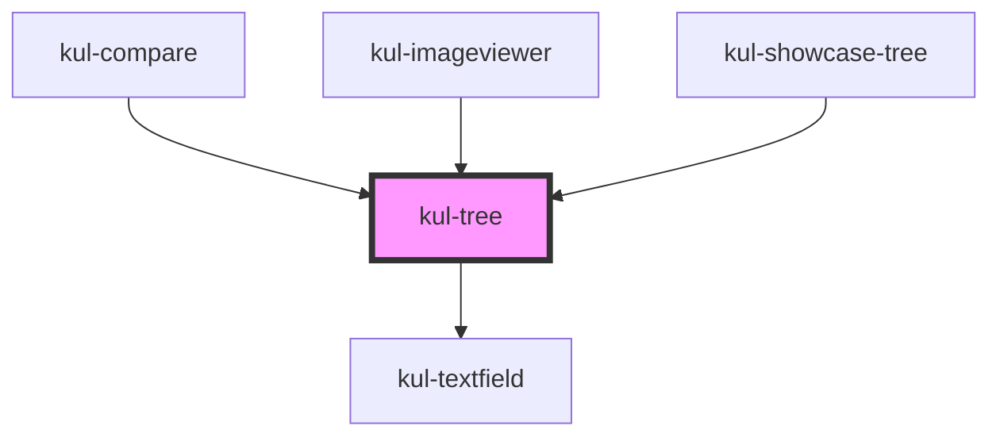

# kul-badge

<!-- Auto Generated Below -->

## Properties

| Property                   | Attribute                     | Description                                                                                                                            | Type             | Default         |
| -------------------------- | ----------------------------- | -------------------------------------------------------------------------------------------------------------------------------------- | ---------------- | --------------- |
| `kulAccordionLayout`       | `kul-accordion-layout`        | When enabled, the first level of depth will create an accordion-style appearance for nodes.                                            | `boolean`        | `true`          |
| `kulData`                  | --                            | The actual data of the tree.                                                                                                           | `KulDataDataset` | `null`          |
| `kulEmpty`                 | `kul-empty`                   | Empty text displayed when there is no data.                                                                                            | `string`         | `"Empty data."` |
| `kulFilter`                | `kul-filter`                  | When true, displays a text field which enables filtering the dataset of the tree.                                                      | `boolean`        | `true`          |
| `kulInitialExpansionDepth` | `kul-initial-expansion-depth` | Sets the initial expanded nodes based on the specified depth. If the property is not provided, all nodes in the tree will be expanded. | `number`         | `undefined`     |
| `kulRipple`                | `kul-ripple`                  | When set to true, the pointerdown event will trigger a ripple effect.                                                                  | `boolean`        | `true`          |
| `kulSelectable`            | `kul-selectable`              | When true, nodes can be selected.                                                                                                      | `boolean`        | `true`          |
| `kulStyle`                 | `kul-style`                   | Enables customization of the component's style.                                                                                        | `string`         | `""`            |

## Events

| Event            | Description | Type                               |
| ---------------- | ----------- | ---------------------------------- |
| `kul-tree-event` |             | `CustomEvent<KulTreeEventPayload>` |

## Methods

### `getDebugInfo() => Promise<KulDebugLifecycleInfo>`

Retrieves the debug information reflecting the current state of the component.

#### Returns

Type: `Promise<KulDebugLifecycleInfo>`

A promise that resolves to a KulDebugLifecycleInfo object containing debug information.

### `getProps() => Promise<KulTreePropsInterface>`

Used to retrieve component's properties and descriptions.

#### Returns

Type: `Promise<KulTreePropsInterface>`

Promise resolved with an object containing the component's properties.

### `refresh() => Promise<void>`

Triggers a re-render of the component to reflect any state changes.

#### Returns

Type: `Promise<void>`

### `unmount(ms?: number) => Promise<void>`

Initiates the unmount sequence, which removes the component from the DOM after a delay.

#### Parameters

| Name | Type     | Description              |
| ---- | -------- | ------------------------ |
| `ms` | `number` | - Number of milliseconds |

#### Returns

Type: `Promise<void>`

## CSS Custom Properties

| Name                                          | Description                                                                                                                                           |
| --------------------------------------------- | ----------------------------------------------------------------------------------------------------------------------------------------------------- |
| `--kul-tree-accordion-background-color`       | Sets the background color for top-level nodes (data-depth="0") when kul-accordion-layout is applied. Defaults to #ffffff.                             |
| `--kul-tree-accordion-border-radius`          | Sets the border radius for top-level nodes (data-depth="0") when kul-accordion-layout is applied. Defaults to 4px.                                    |
| `--kul-tree-accordion-color`                  | Sets the text color for top-level nodes (data-depth="0") when kul-accordion-layout is applied. Defaults to #000000.                                   |
| `--kul-tree-accordion-font-size`              | Sets the font size for top-level nodes (data-depth="0") when kul-accordion-layout is applied. Defaults to 1.125em.                                    |
| `--kul-tree-accordion-hover-background-color` | Sets the background color for top-level nodes (data-depth="0") on hover when kul-accordion-layout is applied. Defaults to var(--kul-primary-color).   |
| `--kul-tree-accordion-hover-color`            | Sets the text color for top-level nodes (data-depth="0") on hover when kul-accordion-layout is applied. Defaults to var(--kul-text-on-primary-color). |
| `--kul-tree-accordion-node-height`            | Sets the height of top-level nodes (data-depth="0") when the tree has an accordion layout. Defaults to 4em.                                           |
| `--kul-tree-backdrop-filter`                  | Sets the backdrop filter of the tree. Defaults to blur(3.5px).                                                                                        |
| `--kul-tree-node-background-color-hover`      | Sets the background color when hovering a node. Defaults to rgba(var(--kul-primary-color-rgb), 0.175).                                                |
| `--kul-tree-node-background-color-selected`   | Sets the background color of the selected node. Defaults to rgba(var(--kul-primary-color-rgb), 0.375).                                                |
| `--kul-tree-node-height`                      | Sets the height for all nodes. Replaces the static value previously used. Defaults to 2em.                                                            |
| `--kul-tree-node-padding`                     | Sets the padding of nodes. Defaults to 0 1em.                                                                                                         |
| `--kul-tree-padding`                          | Sets the padding of the tree. Defaults to 0.                                                                                                          |
| `--kul-tree-text-color`                       | Sets the text color of the tree. Defaults to var(--kul-text-color).                                                                                   |

## Dependencies

### Used by

 - [kul-compare](../kul-compare)
 - [kul-imageviewer](../kul-imageviewer)
 - [kul-showcase-tree](../kul-showcase/components/tree)

### Depends on

- [kul-textfield](../kul-textfield)

### Graph

----------------------------------------------

*Built with [StencilJS](https://stenciljs.com/)*
