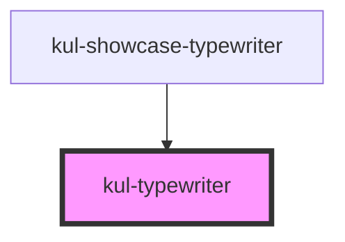

# kul-typewriter

<!-- Auto Generated Below -->

## Properties

| Property | Attribute | Description | Type | Default |
| --- | --- | --- | --- | --- |
| `kulCursor` | `kul-cursor` | Enables or disables the blinking cursor. | `boolean` | `true` |
| `kulDeleteSpeed` | `kul-delete-speed` | Sets the deleting speed in milliseconds. | `number` | `50` |
| `kulLoop` | `kul-loop` | Enables or disables looping of the text. | `boolean` | `false` |
| `kulPause` | `kul-pause` | Sets the duration of the pause after typing a complete text. | `number` | `500` |
| `kulSpeed` | `kul-speed` | Sets the typing speed in milliseconds. | `number` | `50` |
| `kulStyle` | `kul-style` | Customizes the style of the component. This property allows you to apply a custom CSS style to the component. | `string` | `''` |
| `kulValue` | `kul-value` | Sets the text or array of texts to display with the typewriter effect. | `string \| string[]` | `''` |

## Events

| Event | Description | Type |
| --- | --- | --- |
| `kul-typewriter-event` | Describes the component's events. | `CustomEvent<KulTypewriterEventPayload>` |

## Methods

### `getDebugInfo() => Promise<KulDebugLifecycleInfo>`

Fetches debug information of the component's current state.

#### Returns

Type: `Promise<KulDebugLifecycleInfo>`

A promise that resolves with the debug information object.

### `getProps(descriptions?: boolean) => Promise<GenericObject>`

Used to retrieve component's props values.

#### Parameters

| Name | Type | Description |
| --- | --- | --- |
| `descriptions` | `boolean` | - When provided and true, the result will be the list of props with their description. |

#### Returns

Type: `Promise<GenericObject<unknown>>`

List of props as object, each key will be a prop.

### `refresh() => Promise<void>`

This method is used to trigger a new render of the component.

#### Returns

Type: `Promise<void>`

### `unmount(ms?: number) => Promise<void>`

Initiates the unmount sequence, which removes the component from the DOM after a delay.

#### Parameters

| Name | Type     | Description              |
| ---- | -------- | ------------------------ |
| `ms` | `number` | - Number of milliseconds |

#### Returns

Type: `Promise<void>`

## CSS Custom Properties

| Name | Description |
| --- | --- |
| `--kul-typewriter-cursor-color` | Color of the blinking cursor. Defaults to the same color as text. |
| `--kul-typewriter-cursor-width` | Width of the blinking cursor. Defaults to 2px. |
| `--kul-typewriter-font-family` | Font family for the text. Defaults to inherit. |
| `--kul-typewriter-font-size` | Font size for the text. Defaults to inherit. |
| `--kul-typewriter-text-color` | Color of the text being typed. Defaults to currentColor. |

## Dependencies

### Used by

- [kul-showcase-typewriter](../kul-showcase/components/typewriter)

### Graph

---

_Built with [StencilJS](https://stenciljs.com/)_
