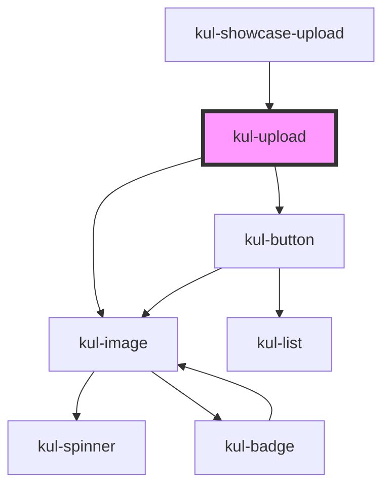

# kul-badge

<!-- Auto Generated Below -->

## Properties

| Property    | Attribute    | Description                                                           | Type      | Default             |
| ----------- | ------------ | --------------------------------------------------------------------- | --------- | ------------------- |
| `kulLabel`  | `kul-label`  | Sets the button's label.                                              | `string`  | `"Upload files..."` |
| `kulRipple` | `kul-ripple` | When set to true, the pointerdown event will trigger a ripple effect. | `boolean` | `true`              |
| `kulStyle`  | `kul-style`  | Enables customization of the component's style.                       | `string`  | `""`                |
| `kulValue`  | `kul-value`  | Initializes the component with these files.                           | `any`     | `null`              |

## Events

| Event              | Description | Type                                 |
| ------------------ | ----------- | ------------------------------------ |
| `kul-upload-event` |             | `CustomEvent<KulUploadEventPayload>` |

## Methods

### `getDebugInfo() => Promise<KulDebugLifecycleInfo>`

Retrieves the debug information reflecting the current state of the component.

#### Returns

Type: `Promise<KulDebugLifecycleInfo>`

A promise that resolves to a KulDebugLifecycleInfo object containing debug information.

### `getProps() => Promise<GenericObject>`

Used to retrieve component's properties and descriptions.

#### Returns

Type: `Promise<GenericObject<unknown>>`

Promise resolved with an object containing the component's properties.

### `getValue() => Promise<File[]>`

Returns the component's internal value.

#### Returns

Type: `Promise<File[]>`

### `refresh() => Promise<void>`

Triggers a re-render of the component to reflect any state changes.

#### Returns

Type: `Promise<void>`

### `unmount(ms?: number) => Promise<void>`

Initiates the unmount sequence, which removes the component from the DOM after a delay.

#### Parameters

| Name | Type     | Description              |
| ---- | -------- | ------------------------ |
| `ms` | `number` | - Number of milliseconds |

#### Returns

Type: `Promise<void>`

## CSS Custom Properties

| Name                                 | Description                                                                                                              |
| ------------------------------------ | ------------------------------------------------------------------------------------------------------------------------ |
| `--kul-upload-backdrop-filter`       | Sets the backdrop filter for the upload component. Defaults to a blur effect of 5px.                                     |
| `--kul-upload-backdrop-filter-hover` | Sets the backdrop filter for the upload component on hover. Defaults to a blur effect of 10px.                           |
| `--kul-upload-border`                | Sets the border for the upload component. Defaults to a 1px solid border with a color defined by --kul-border-color-rgb. |
| `--kul-upload-border-radius`         | Sets the border radius for the upload component. Defaults to 4px.                                                        |
| `--kul-upload-button-height`         | Sets the height of the upload button. Defaults to 42px.                                                                  |
| `--kul-upload-button-text-transform` | Sets the text transformation for the upload button. Defaults to uppercase.                                               |
| `--kul-upload-grid-gap`              | Sets the grid gap for the upload component. Defaults to 20px.                                                            |
| `--kul-upload-info-height`           | Sets the height of the info section in the upload component. Defaults to 1fr.                                            |
| `--kul-upload-padding`               | Sets the padding for the upload component. Defaults to 1em.                                                              |

## Dependencies

### Used by

 - [kul-showcase-upload](../kul-showcase/components/upload)

### Depends on

- [kul-image](../kul-image)
- [kul-button](../kul-button)

### Graph

----------------------------------------------

*Built with [StencilJS](https://stenciljs.com/)*
